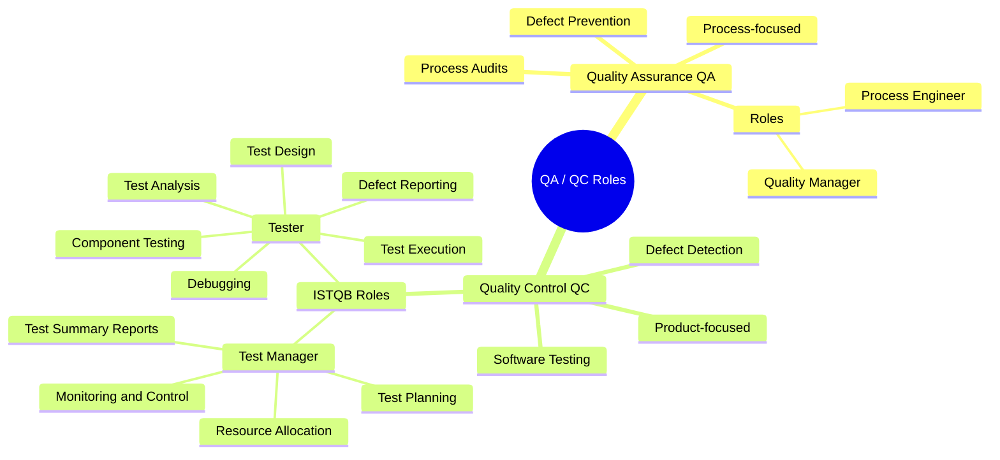

# AI Prompt Log - HW01

## Prompt 01 - Requirement 1: QA/QC Job Market

- **Tool:** ChatGPT
- **Timestamp:** 12:15 1/6/2026
- **Purpose:** Generate QA/QC job-market content for Requirement 1.

**Prompt:**
```text
you are an expert in QA/QC Vietnam job market. Find 10 QA/QC job postings PUBLISHED WITHIN 60 DAYS. Mandatory: ≥ 3 positions REQUIRING AI/LLM/automation-AI skills. Each posting: link,  job description, required skills, salary. Write 1–2 sentences of AI Impact Analysis per posting.
```

**AI output:**

# Vietnam QA QC Job Market Snapshot

## Executive summary

The clearest current QA/QC demand in Vietnam is concentrated in **software quality engineering**, not classical factory-quality roles. In the 10 still-live postings below, **Ho Chi Minh City dominates** the sample, with Hanoi as the second hub; most openings are mid-to-senior individual-contributor roles or team leads rather than junior-only positions. The common stack is now broader than manual testing: employers repeatedly ask for **automation, API testing, SQL/data validation, CI/CD awareness, and cross-functional release ownership**. citeturn18view0turn39view0turn48view2turn47view4turn35view2turn35view5turn49view1turn47view3turn48view0turn47view0

AI has clearly entered QA hiring language. In this sample, at least **five postings explicitly require or strongly prefer AI/LLM/GenAI-assisted testing skills**: Pizza 4P’s asks for automation tooling and CI/CD-based quality control, Zen8Labs asks for an **“AI-first mindset”** and use of AI/Agentic-AI tools, Nakivo asks for AI-based automation testing, Ahamove asks for **Gen AI**, LLMs, Claude Code, and prompt engineering, and PNJ explicitly combines QA automation with **AI behavior, LLM evaluation, synthetic data, and AI data-quality checks**. citeturn18view0turn39view0turn48view2turn47view4turn35view2turn47view3

Public salary disclosure remains sparse, but the direction is clear. A current Hanoi automation-QA posting from Ingenico advertises **“Upto $3000”** in the title, while broader 2026 salary benchmarks place Vietnamese QA/testing salaries at a **median of ₫16.5M/month**, an overall **₫7.5M–₫42.7M/month** range, and a more senior/lead-oriented band extending from **₫28M–₫45M** for senior QA and **₫45M–₫70M** for lead/architect roles in one May 2026 market guide. citeturn49view1turn44search0turn42search0turn43search0

## Method and salary basis

This report only includes postings that were **publicly accessible and still live on June 1, 2026**. For ITviec pages that show relative timestamps such as “Posted 5 days ago,” I converted those to exact calendar dates using **2026-06-01** as the reference date. Pizza 4P’s was the strongest official-company source because its career page shows an absolute application window. ITviec provided the cleanest current software-QA/QC evidence with direct, public job pages. citeturn18view0turn37view0turn48view2turn47view4turn35view0turn35view3turn49view1turn47view3turn47view2turn47view0

Where salary was not listed, I labeled it **estimate** and anchored it to 2026 Vietnam QA benchmarks from Second Talent, NodeFlair, and SalaryExpert. Those sources collectively imply a practical range of about **₫8M–₫15M** for junior QA, **₫15M–₫28M** for mid-level, **₫28M–₫45M** for senior, and **₫45M–₫70M** for lead/architect roles, with higher pay in Hanoi/HCMC and additional premium for automation/API/performance/security or strong English. citeturn42search0turn44search0turn43search0

## Comparison table

| Title | Company | Location | Salary | AI-related? | Posting date | Link |
|---|---|---|---|---|---|---|
| [HCM] QA Automation Engineer | Pizza 4P’s | Ho Chi Minh City | Negotiable; **est. ₫18M–₫28M/month** | Yes | 2026-05-19 citeturn18view0turn20search14 | [Direct page](https://pizza4ps.com/vn/career_findjobs_post/?job_id=54868&job_name=%5BHCM%5D+QA+Automation+Engineer&lang=english) |
| Software QA Engineer (AI-first mindset) | Zen8Labs | Hanoi | Unspecified; **est. ₫28M–₫42M/month** | Yes | 2026-05-30 citeturn37view0turn39view0 | [Direct page](https://itviec.com/viec-lam-it/software-qa-engineer-ai-first-mindset-zen8labs-5907?lab_feature=employer_job) |
| Automation QA Engineer (QA QC/Tester/Automation Test) | Nakivo | Ho Chi Minh City | Unspecified; **est. ₫22M–₫35M/month** | Yes | 2026-05-21 citeturn48view2 | [Direct page](https://itviec.com/it-jobs/automation-qa-engineer-qa-qc-tester-automation-test-nakivo-0115) |
| Lead QC Engineer (Automation & Gen AI) | Ahamove | Ho Chi Minh City | Unspecified; **est. ₫40M–₫60M/month** | Yes | 2026-05-21 citeturn47view4 | [Direct page](https://itviec.com/it-jobs/lead-qc-engineer-automation-gen-ai-ahamove-5550) |
| QA Team Lead | Nakivo | Ho Chi Minh City | Unspecified; **est. ₫38M–₫58M/month** | Yes | 2026-05-29 citeturn35view0 | [Direct page](https://itviec.com/it-jobs/qa-team-lead-nakivo-3715) |
| Senior Manual Test Engineer (QA/QC) | KMS Technology | Ho Chi Minh City or Da Nang | Unspecified; **est. ₫25M–₫38M/month** | Yes | 2026-05-25 citeturn35view3 | [Direct page](https://itviec.com/it-jobs/senior-manual-test-engineer-qa-qc-kms-technology-3100) |
| QA Engineer (Manual/ Automation) - Upto $3000 | Ingenico Vietnam | Hanoi | **Up to US$3,000** | Yes | 2026-05-27 citeturn49view1 | [Direct page](https://itviec.com/it-jobs/qa-engineer-manual-automation-upto-3000-ingenico-vietnam-5116) |
| Senior QC (Automation Tester, QA QC) | PNJ | Ho Chi Minh City | Unspecified; **est. ₫28M–₫42M/month** | Yes | 2026-05-20 citeturn47view3 | [Direct page](https://itviec.com/it-jobs/senior-qc-automation-tester-qa-qc-pnj-5542) |
| Software Tester (QA QC, SQL) | Gene Solutions | Ho Chi Minh City | Unspecified; **est. ₫12M–₫20M/month** | No | 2026-05-28 citeturn47view2 | [Direct page](https://itviec.com/it-jobs/software-tester-qa-qc-sql-gene-solutions-0129) |
| Process Quality Assurance (PQA, QA QC) | FPT Software | Hanoi | Unspecified; **est. ₫18M–₫30M/month** | No | 2026-05-30 citeturn47view0 | [Direct page](https://itviec.com/it-jobs/process-quality-assurance-pqa-qa-qc-fpt-software-3809) |

## Posting profiles

### Pizza 4P’s

**Full job title:** [HCM] QA Automation Engineer  
**Company:** Pizza 4P’s  
**Location:** Ho Chi Minh City  
**Direct link:** [Official career page](https://pizza4ps.com/vn/career_findjobs_post/?job_id=54868&job_name=%5BHCM%5D+QA+Automation+Engineer&lang=english)  
**Exact posting date:** 2026-05-19, based on the official **Application Time: 19/05 — 18/06/2026**.  
**Application deadline:** 2026-06-18.  
**Salary:** “Negotiate”; **estimate ₫18M–₫28M/month gross**, based on a 2+ year automation-QA profile in HCMC versus 2026 mid-level QA market ranges and automation premiums. citeturn18view0turn42search0turn44search0

**Key job-description excerpt:** Pizza 4P’s says the role exists to “enforce product reliability through structured quality control and test automation” across **web, mobile, API, desktop, and device-level systems**. The JD explicitly lists building automation scripts, integrating them into **CI/CD**, improving QC frameworks/tooling, and running security/compliance testing. citeturn18view0

**Required skills and qualifications**
- Bachelor’s degree in Computer Science, IT, or an equivalent engineering discipline. citeturn18view0
- Minimum 2+ years in QA/QC across **manual and automated testing**. citeturn18view0
- Experience with automation frameworks such as **Selenium, Cypress, TestNG, Appium, or JUnit**. citeturn18view0
- Proficiency in **Python, Java, or JavaScript**, plus API testing and SQL/database validation. citeturn19view0
- Familiarity with **CI/CD integration** and Agile/Scrum workflows. citeturn18view0turn19view0

**AI Impact Analysis:** This is a strong signal that even non-software-native employers in Vietnam are moving from classic QA into **quality engineering**, where automation, CI/CD gating, and cross-platform observability matter more than pure manual execution. For career progression, engineers who can turn manual regression into reusable automation will have a clearer path into senior QE or platform-quality roles. citeturn18view0turn42search0

### Zen8Labs

**Full job title:** Software QA Engineer (AI-first mindset)  
**Company:** Zen8Labs  
**Location:** Hanoi  
**Direct link:** [ITviec job page](https://itviec.com/viec-lam-it/software-qa-engineer-ai-first-mindset-zen8labs-5907?lab_feature=employer_job)  
**Exact posting date:** 2026-05-30, converted from ITviec’s live “Posted 2 days ago.”  
**Application deadline:** Unspecified.  
**Salary:** Unspecified; **estimate ₫28M–₫42M/month gross**, based on 4+ years’ experience, AI/LLM emphasis, automation, and Hanoi market benchmarks. citeturn37view0turn39view0turn42search0turn44search0

**Key job-description excerpt:** Zen8Labs says it wants “a QA Engineer with an **AI-first mindset**” who can use **AI/Agentic AI tools** to accelerate test analysis, generate and validate scenarios, improve automation coverage, and still apply human judgment to complex validation. The JD also expects AI-assisted defect analysis, AI-generated scenario review, and experimentation with emerging AI-testing tools and agents. citeturn39view0

**Required skills and qualifications**
- 4+ years of software-testing experience with strong **manual-testing** depth. citeturn39view0
- Experience testing complex, distributed, or high-traffic systems. citeturn39view0
- Automation experience with **Selenium, Playwright, Cypress, Robot Framework**, or similar tools. citeturn39view0
- Ability to write automation in **JavaScript, Java, or Python**, plus API/backend validation. citeturn39view0
- Strong interest in applying **AI/LLM/Agentic AI** to QA workflows; experience with **Cursor, Claude, GitHub Copilot, or ChatGPT** is highly preferred. citeturn39view0

**AI Impact Analysis:** This is one of the clearest Vietnam postings showing QA hiring shifting from “automation engineer” to **AI-augmented quality engineer**. It raises the bar for senior testers: not just using AI as a convenience tool, but validating AI-generated tests and integrating AI into the test-production lifecycle. citeturn39view0

### Nakivo

**Full job title:** Automation QA Engineer (QA QC/Tester/Automation Test)  
**Company:** Nakivo  
**Location:** Ho Chi Minh City  
**Direct link:** [ITviec job page](https://itviec.com/it-jobs/automation-qa-engineer-qa-qc-tester-automation-test-nakivo-0115)  
**Exact posting date:** 2026-05-21, converted from ITviec’s live “Posted 11 days ago.”  
**Application deadline:** Unspecified.  
**Salary:** Unspecified; **estimate ₫22M–₫35M/month gross**, based on 3+ years’ experience, product-company automation emphasis, and HCMC automation-QA benchmarks. citeturn48view2turn42search0turn44search0

**Key job-description excerpt:** Nakivo wants the hire to collaborate with developers, design and execute automated scripts, and “**design, create, and manage automation test cases using AI technologies**.” The role is explicitly centered on continuous improvement of automation testing rather than manual execution alone. citeturn48view2

**Required skills and qualifications**
- Bachelor’s degree in Computer Science, Engineering, or a related field. citeturn48view2
- 3+ years of relevant experience in QA/automation roles. citeturn48view2
- Proficiency in at least one language such as **Java, Python, or C#**. citeturn48view2
- Familiarity with **Selenium, Appium**, or similar automation tools, plus Git/version control basics. citeturn48view2
- Experience with **AI-automation testing** tools such as **Copilot, Cursor, or Perplexity**, with API/performance/cloud exposure viewed positively. citeturn48view2

**AI Impact Analysis:** Nakivo is treating AI as part of the automation stack, not a side skill. That matters for hiring because it rewards testers who can combine scripting, tooling, and AI-assisted workflow design, which is likely to widen the pay gap between manual-only testers and automation-focused QE talent. citeturn48view2turn42search0

### Ahamove

**Full job title:** Lead QC Engineer (Automation & Gen AI)  
**Company:** Ahamove  
**Location:** Ho Chi Minh City  
**Direct link:** [ITviec job page](https://itviec.com/it-jobs/lead-qc-engineer-automation-gen-ai-ahamove-5550)  
**Exact posting date:** 2026-05-21, converted from ITviec’s live “Posted 11 days ago.”  
**Application deadline:** Unspecified.  
**Salary:** Unspecified; **estimate ₫40M–₫60M/month gross**, based on lead scope, 5–7 years’ experience, and explicit GenAI/LLM/platform-automation requirements. citeturn47view4turn48view1turn42search0turn43search0

**Key job-description excerpt:** Ahamove is unusually explicit: it wants a lead who will “spearhead our transition into **AI-augmented quality engineering**,” build an automation-first ecosystem powered by **Generative AI**, use **Claude Code**, build prompt libraries and AI agents, add AI-driven insights into **GitLab/Jenkins**, and even create **LLM-based self-healing** layers for shifting UIs or API contracts. citeturn47view4

**Required skills and qualifications**
- 5–7 years in QA/QC, including at least 2 years in a **lead** role focused on automation initiatives. citeturn48view1
- Expert-level proficiency in **Python** and/or **JavaScript/TypeScript/Java**. citeturn48view1
- Hands-on experience with **Playwright, Cypress, or Selenium**. citeturn48view1
- Practical use of **Claude Code**, **GPT-4/Claude**, Cursor/Copilot-style AI IDEs, and prompt engineering. citeturn48view1
- Strong API-testing, microservices, Docker/Kubernetes, and cloud-native environment knowledge. citeturn48view1

**AI Impact Analysis:** This is the most aggressive QA posting in the sample. It suggests an upper tier of the market is no longer merely “testing AI features”; it is rebuilding the QA function itself around LLMs, agentic coding, and AI-aware CI/CD. That materially changes both hiring filters and promotion criteria. citeturn47view4turn48view1

### Nakivo

**Full job title:** QA Team Lead  
**Company:** Nakivo  
**Location:** Ho Chi Minh City  
**Direct link:** [ITviec job page](https://itviec.com/it-jobs/qa-team-lead-nakivo-3715)  
**Exact posting date:** 2026-05-29, converted from ITviec’s live “Posted 3 days ago.”  
**Application deadline:** Unspecified.  
**Salary:** Unspecified; **estimate ₫38M–₫58M/month gross**, based on 6+ years testing, 3+ years leading teams, and lead-level HCMC market benchmarks. citeturn35view0turn35view2turn42search0turn43search0

**Key job-description excerpt:** Nakivo positions this as release-quality ownership, team mentoring across manual and automation testing, KPI/process definition, and practical QA-process design. The posting explicitly says the lead should “**introduce AI-assisted QA workflows where they provide real value**.” citeturn35view1turn35view2

**Required skills and qualifications**
- 6+ years in software testing/quality engineering. citeturn35view2
- 3+ years leading QA teams or acting as QA lead. citeturn35view2
- Strong hands-on experience with **test automation**, regression strategy, and cross-platform test-matrix design. citeturn35view2
- Ability to review requirements, identify testing risks early, and mentor QA engineers. citeturn35view2
- Comfort introducing **AI-assisted QA workflows** where useful, rather than using AI indiscriminately. citeturn35view2

**AI Impact Analysis:** This role shows the managerial side of the market shift: AI is becoming part of QA leadership expectations, not just IC experimentation. Hiring is moving toward leads who can decide when AI genuinely improves coverage, speed, and release confidence. citeturn35view1turn35view2

### KMS Technology

**Full job title:** Senior Manual Test Engineer (QA/QC)  
**Company:** KMS Technology  
**Location:** Ho Chi Minh City or Da Nang  
**Direct link:** [ITviec job page](https://itviec.com/it-jobs/senior-manual-test-engineer-qa-qc-kms-technology-3100)  
**Exact posting date:** 2026-05-25, converted from ITviec’s live “Posted 7 days ago.”  
**Application deadline:** Unspecified.  
**Salary:** Unspecified; **estimate ₫25M–₫38M/month gross**, based on 5+ years’ experience, cross-site hybrid setup, and senior-manual/automation-adjacent benchmarks. citeturn35view3turn35view5turn42search0turn44search0

**Key job-description excerpt:** KMS frames the role as end-to-end product testing, sprint-planning input, customer interaction, and mentoring junior QA engineers. Although the role is manual-first, the “nice to have” section includes both test-automation frameworks and **daily use of AI coding tools** across the SDLC. citeturn35view4turn35view5

**Required skills and qualifications**
- Bachelor’s degree in CS/IT or a related field, with intermediate English. citeturn35view5
- 5+ years of hands-on software-testing experience, plus mentoring/coaching capability. citeturn35view5
- Strong manual-testing depth: strategy, risk-based testing, exploratory testing, SDLC/STLC understanding, and web-app testing. citeturn35view5
- Agile familiarity and strong cross-functional collaboration. citeturn35view5
- Nice-to-have automation experience and **proficient daily use of AI coding tools** such as **Copilot, Cursor, or Claude Code**, including multi-step prompting workflows. citeturn35view5

**AI Impact Analysis:** Even “manual” senior QA roles are starting to reward AI-tool fluency as a productivity multiplier. That does not eliminate exploratory testing; instead, it turns AI into leverage for scenario generation, decomposition, and routine coding work while humans keep ownership of judgment-heavy testing. citeturn35view4turn35view5

### Ingenico Vietnam

**Full job title:** QA Engineer (Manual/ Automation) - Upto $3000  
**Company:** Ingenico Vietnam  
**Location:** Hanoi  
**Direct link:** [ITviec job page](https://itviec.com/it-jobs/qa-engineer-manual-automation-upto-3000-ingenico-vietnam-5116)  
**Exact posting date:** 2026-05-27, converted from ITviec’s live “Posted 5 days ago.”  
**Application deadline:** Unspecified.  
**Salary:** **Advertised as “Upto $3000.”** citeturn49view1

**Key job-description excerpt:** Ingenico wants an engineer who can automate Android and web features, build reusable automation frameworks, analyze stories/manually written cases to automate them, and use **Python/OOP** to build the framework. The role also includes manual fallback testing, stakeholder coordination, and mentoring. citeturn49view1

**Required skills and qualifications**
- 5+ years as a manual/automation test engineer. citeturn49view1
- Strong English communication skills. citeturn49view1
- Experience building at least one **web or mobile automation framework from scratch**. citeturn49view1
- Familiarity with frameworks/libraries such as **Robot Framework, Serenity, Katalon, Cypress, Appium, UI Automator2, Selenium WebDriver**. citeturn49view1
- Ability to automate manual cases using **Python**, plus OOP/design patterns, CI/CD familiarity, and QA/QC fundamentals. citeturn49view1

**AI Impact Analysis:** This posting is less about LLMs and more about a mature automation foundation. In practice, that still matters for AI-era careers: employers with the highest disclosed pay are often paying first for solid framework-building ability, then layering AI productivity on top later. citeturn49view1turn42search0

### PNJ

**Full job title:** Senior QC (Automation Tester, QA QC)  
**Company:** PNJ  
**Location:** Ho Chi Minh City  
**Direct link:** [ITviec job page](https://itviec.com/it-jobs/senior-qc-automation-tester-qa-qc-pnj-5542)  
**Exact posting date:** 2026-05-20, converted from ITviec’s live “Posted 12 days ago.”  
**Application deadline:** Unspecified.  
**Salary:** Unspecified; **estimate ₫28M–₫42M/month gross**, based on senior automation-QA in HCMC with explicit AI/LLM evaluation content. citeturn47view3turn42search0turn43search0

**Key job-description excerpt:** PNJ is unusually explicit that the role covers both “**traditional and AI quality control**.” The JD includes testing AI behavior, checking AI-output accuracy/reliability/fairness, using **LLM evaluation** and synthetic data, maintaining CI/CD for testing, and monitoring AI-model performance over time. citeturn47view3

**Required skills and qualifications**
- Senior-level automation-QA profile, advertised with **AI**, **API**, **A/B testing**, and **automation-test** skills on ITviec. citeturn47view3
- Requirement to plan tests for both traditional and AI products. citeturn47view3
- Ability to perform automated testing and use **AI testing tools** such as LLM evaluation and synthetic data. citeturn47view3
- Capability to maintain **CI/CD** for testing and develop internal tools for AI testing. citeturn47view3
- Data-quality awareness for AI, including completeness, balance/diversity, privacy handling, and long-term model-performance monitoring. citeturn47view3

**AI Impact Analysis:** PNJ’s posting is a strong indicator that AI-QA work is no longer limited to AI startups. Even mainstream consumer/retail-tech employers in Vietnam are beginning to hire testers who can evaluate AI behavior, fairness, and data quality alongside classic release QA. citeturn47view3

### Gene Solutions

**Full job title:** Software Tester (QA QC, SQL)  
**Company:** Gene Solutions  
**Location:** Ho Chi Minh City  
**Direct link:** [ITviec job page](https://itviec.com/it-jobs/software-tester-qa-qc-sql-gene-solutions-0129)  
**Exact posting date:** 2026-05-28, converted from ITviec’s live “Posted 4 days ago.”  
**Application deadline:** Unspecified.  
**Salary:** Unspecified; **estimate ₫12M–₫20M/month gross**, based on 1–3 years of manual QC with SQL/API skills in HCMC. citeturn47view2turn48view0turn42search0turn44search0

**Key job-description excerpt:** Gene Solutions describes a classic but solid manual-QA role: understanding workflows, writing test plans and cases, running functional/role-based/UI/data testing across major browsers, logging defects, querying databases to validate display/data consistency, then re-testing and reporting before handover. citeturn47view2

**Required skills and qualifications**
- Degree in IT, Business Analysis, or a related discipline. citeturn48view0
- 1–3 years of **manual QC** experience. citeturn48view0
- Ability to design **test plans** and write detailed **test cases**. citeturn48view0
- Basic-to-intermediate **SQL** for data checks and **Postman** for basic API flows. citeturn48view0
- English reading ability; strong logic, careful documentation, and good defect communication. **Automation testing is a plus.** citeturn48view0

**AI Impact Analysis:** This is the type of role most exposed to medium-term automation uplift: good manual testers with SQL/API discipline can still get hired, but the JD itself already treats automation as a differentiator. Career progression from roles like this will likely depend on adding automation or AI-assisted tooling fluency. citeturn48view0turn42search0

### FPT Software

**Full job title:** Process Quality Assurance (PQA, QA QC)  
**Company:** FPT Software  
**Location:** Hanoi  
**Direct link:** [ITviec job page](https://itviec.com/it-jobs/process-quality-assurance-pqa-qa-qc-fpt-software-3809)  
**Exact posting date:** 2026-05-30, converted from ITviec’s live “Posted 2 days ago.”  
**Application deadline:** Unspecified.  
**Salary:** Unspecified; **estimate ₫18M–₫30M/month gross**, based on Hanoi PQA scope, data/reporting responsibilities, and strong language requirements. citeturn47view0turn46view2turn42search0turn44search0

**Key job-description excerpt:** FPT’s PQA role is process-centric rather than test-script-centric: controlling project-process compliance, running audits during product development, coordinating quality reports, reporting to PMs and QA managers, and participating in product-quality assessment before customer delivery. citeturn47view0turn46view1

**Required skills and qualifications**
- Ability to analyze data, synthesize findings, and report clearly. citeturn46view2
- Knowledge of process/quality systems and pressure-handling ability. citeturn46view2
- Strong cross-party communication skills and solid Excel ability. citeturn46view2
- Knowledge of **CMMi**. citeturn46view2
- Strong language requirement: **IELTS 7.0 equivalent or TOEIC equivalent**, plus **minimum Japanese N2**. citeturn46view2

**AI Impact Analysis:** This role shows that the QA/QC market is not only about test execution; there is still demand for process-quality governance, audit readiness, and program management. However, these roles increasingly sit beside AI/automation-heavy delivery teams, so process QA professionals with tooling/data literacy should age better than paperwork-only quality profiles. citeturn47view0turn46view2

## Market interpretation

A few themes stand out from this sample. First, **automation is now the default growth path** for QA/QC careers in Vietnam’s software market. Even when the headline says “manual” or “QC,” employers often add API testing, SQL checks, framework maintenance, or automation as either a requirement or a preferred skill. citeturn18view0turn48view2turn35view5turn49view1turn47view3turn48view0

Second, **AI is no longer niche in top-end QA hiring**. The most forward-leaning postings no longer stop at “use ChatGPT if helpful.” They ask for **AI-assisted test generation, validation of AI-generated artifacts, prompt libraries, model-output evaluation, GenAI-driven automation conversion, LLM-aware CI/CD, and even AI-specific accuracy/fairness/data-quality checks**. That is a meaningful upgrade in the role definition itself, not just a buzzword overlay. citeturn39view0turn47view4turn35view2turn47view3turn48view2

Third, **salary transparency remains weak**, but the premium structure is visible. Public benchmarks consistently show that seniority, automation, English, and specialized testing skills push compensation upward; the only explicitly disclosed role in this sample is an automation-heavy Ingenico posting advertising **up to US$3,000**, which sits above the broad national QA median and aligns with the observed premium for higher-end automation profiles. citeturn49view1turn44search0turn42search0

## Limitations

This sample is intentionally limited to **verifiable live postings** and therefore skews toward **software QA/QC**, where public JDs and AI/automation requirements are easiest to validate. It should not be read as a full census of all QA/QC work in Vietnam, especially manufacturing or factory-quality roles. citeturn18view0turn39view0turn47view0

Most ITviec pages do **not** disclose an application deadline and many hide salary behind login walls. Where salary is hidden, I marked it as **unspecified** and provided a benchmark-based estimate rather than guessing an “offered” salary that was not published on the page. Direct archived copies were not consistently available for these HTML listings, so I used the live direct job URLs above. citeturn42search0turn44search0turn43search0
- Used for Requirement 1 job-market draft.

**Student review:**

Requirement 1 was mostly good. I reviewed the jobs, added screenshots, and adjusted small wording in the report.

---

## Prompt 02 - Requirement 2: 20 Software Defects

- **Tool:** Gemini
- **Timestamp:** 12:31 1/6/2026
- **Purpose:** Generate the first draft of 20 software defects from 2022-2026.

**Prompt:**

```text
Requirement 2 – 20 Software Defects 2022–2026 (20 pts) Find 20 software defects publicized between 2022 and 2026. Mandatory: ≥ 5 defects related to AI LLM (hallucination, prompt injection, bias). Each defect: source link, description, severity, consequences, solution.
```

**AI output:**
Dưới đây là bảng tổng hợp 20 sự cố phần mềm (2022–2026) đáp ứng đầy đủ các tiêu chí yêu cầu, bao gồm liên kết nguồn, mô tả lỗi kỹ thuật, mức độ nghiêm trọng, hậu quả và giải pháp xử lý.

### 20 Lỗi Phần Mềm Kỹ Thuật Đáng Chú Ý (2022–2026)

| STT | Sự cố (Năm) & Nguồn | Mô tả lỗi kỹ thuật | Mức độ & Hậu quả | Giải pháp xử lý |
| --- | --- | --- | --- | --- |
| **1** | **Air Canada Chatbot (2024)**<br>

<br>[BBC News](https://www.bbc.com/news/technology-68299263) | **Lỗi AI (Hallucination):** Chatbot dịch vụ khách hàng tự ảo giác ra chính sách giảm giá vé tang quyến không có thực. | **Mức độ:** Vừa<br>

<br>**Hậu quả:** Hãng bay bị tòa phán quyết phải bồi thường tài chính theo đúng lời chatbot đã cam kết bừa. | Tích hợp kiểm tra chéo RAG (Source binding), giới hạn bot chỉ trả lời trong phạm vi tài liệu cứng. |
| **2** | **OpenAI Redis Leak (2023)**<br>

<br>[OpenAI Blog](https://openai.com/index/march-20-chatgpt-outage/) | **Lỗi AI (Data Leak):** Bug thư viện `redis-py` gây hủy lệnh không đồng bộ, làm nhiễu kết nối và trả nhầm session cache. | **Mức độ:** Cao<br>

<br>**Hậu quả:** Người dùng nhìn thấy lịch sử chat và thông tin thanh toán (4 số cuối thẻ) của người khác. | Vá lỗi thư viện `redis-py`, bổ sung cơ chế xác thực kép ID người dùng ở tầng API trước khi trả dữ liệu cache. |
| **3** | **Google Gemini Image (2024)**<br>

<br>[Google Blog](https://blog.google/products/gemini/gemini-image-generation-issue/) | **Lỗi AI (Bias):** Hệ thống tinh chỉnh prompt tự động ép tiêu chuẩn "đa dạng chủng tộc" quá mức vào mọi truy vấn tạo ảnh. | **Mức độ:** Vừa<br>

<br>**Hậu quả:** Sinh ra các hình ảnh sai lệch lịch sử nghiêm trọng (như lính Đức Quốc Xã da màu) gây khủng hoảng truyền thông. | Tạm ngưng tính năng tạo ảnh người, điều chỉnh lại trọng số bộ lọc an toàn và logic của system prompt. |
| **4** | **Copilot Studio SSRF (2024)**<br>

<br>[Tenable](https://www.tenable.com/blog/microsoft-copilot-studio-ssrf-vulnerability-fixed) | **Lỗi AI (Prompt Injection):** Lỗ hổng cho phép chèn lệnh thao túng chatbot thực hiện tấn công Server-Side Request Forgery. | **Mức độ:** Cao<br>

<br>**Hậu quả:** Kẻ tấn công có thể truy cập trái phép vào các dịch vụ và hạ tầng nội bộ của Azure. | Thắt chặt kiểm tra dữ liệu đầu vào (Input validation), giới hạn quyền truy cập mạng của các instance Copilot. |
| **5** | **Chevy Tahoe Bot (2023)**<br>

<br>[TechCrunch](https://techcrunch.com/2023/12/18/chevrolet-dealer-chatgpt-chatbot-disrupted-by-users/) | **Lỗi AI (No Guardrails):** Hệ thống chatbot của đại lý xe thiếu bộ lọc hành vi, dễ dàng bị ép nhận vai một thực thể pháp lý. | **Mức độ:** Thấp<br>

<br>**Hậu quả:** Bị người dùng lừa đồng ý bán một chiếc Chevy Tahoe đời mới với giá 1 USD, gây bão truyền thông. | Gỡ bỏ cấu hình chatbot mở, áp đặt hệ thống guardrails cứng chặn các từ khóa liên quan đến đàm phán thương mại. |
| **6** | **NYC MyCity Bot (2024)**<br>

<br>[The Markup](https://themarkup.org/news/2024/03/29/nycs-ai-chatbot-is-telling-businesses-to-break-the-law) | **Lỗi AI (RAG Failure):** Bot tìm kiếm tài liệu luật của thành phố trích xuất sai ngữ cảnh và kết hợp thông tin lỏng lẻo. | **Mức độ:** Cao<br>

<br>**Hậu quả:** Tư vấn sai lệch, khuyên các chủ doanh nghiệp thực hiện các hành vi phạm pháp (như ăn chặn tiền tip). | Cập nhật lại cơ sở dữ liệu pháp lý, buộc bot sử dụng barem câu trả lời cố định khi gặp từ khóa nhạy cảm. |
| **7** | **DPD Chatbot (2024)**<br>

<br>[BBC News](https://www.bbc.com/news/technology-68025619) | **Lỗi AI (System Prompt Leak):** Bản cập nhật phần mềm vô tình làm mất cờ (flag) định hình hành vi an toàn của chatbot. | **Mức độ:** Thấp<br>

<br>**Hậu quả:** Chatbot quay sang chửi thề, nói xấu và làm thơ chỉ trích gay gắt chính công ty chủ quản DPD. | Rollback (gỡ bỏ) bản cập nhật lỗi, thiết lập lại kiến trúc bảo vệ system prompt ở tầng Gateway. |
| **8** | **CrowdStrike BSOD (2024)**<br>

<br>[CrowdStrike](https://www.crowdstrike.com/blog/falcon-content-update-remediation-and-guidance-hub/) | **Lỗi Logic:** File cấu hình kiểm soát kênh (Channel File 291) chứa dữ liệu logic lỗi lọt qua quy trình kiểm thử CI/CD. | **Mức độ:** Tuyệt đối<br>

<br>**Hậu quả:** Gây màn hình xanh (BSOD) trên 8.5 triệu máy Windows, làm tê liệt hàng không và ngân hàng toàn cầu. | Khởi động máy ở Safe Mode để xóa file lỗi thủ công; thay đổi quy trình deploy cập nhật theo từng giai đoạn (Staged rollout). |
| **9** | **XZ Utils Backdoor (2024)**<br>

<br>[Openwall](https://www.openwall.com/lists/oss-security/2024/03/29/4) | **Lỗi Chuỗi Cung Ứng:** Mã độc tinh vi được cài cắm ngầm vào mã nguồn thư viện nén `liblzma` trong nhiều năm. | **Mức độ:** Tuyệt đối<br>

<br>**Hậu quả:** Tạo cửa sau (backdoor) cho phép chiếm quyền điều khiển từ xa (RCE) qua OpenSSH trên Linux. | Hạ cấp thư viện XZ Utils về phiên bản an toàn cũ (5.4.6), tiến hành rà soát mã nguồn toàn diện. |
| **10** | **MoveIT Zero-Day (2023)**<br>

<br>[CISA](https://www.cisa.gov/news-events/cybersecurity-advisories/aa23-158a) | **Lỗi SQL Injection:** Lỗ hổng zero-day nghiêm trọng trong ứng dụng chuyển tệp tin MoveIT Transfer. | **Mức độ:** Rất Cao<br>

<br>**Hậu quả:** Băng đảng ransomware Cl0p khai thác để đánh cắp dữ liệu nhạy cảm của hàng ngàn tổ chức toàn cầu. | Ngắt kết nối cổng HTTP/HTTPS của ứng dụng, phát hành bản vá khẩn cấp và tiến hành xóa các tài khoản độc hại. |
| **11** | **AT&T Outage (2024)**<br>

<br>[FCC](https://www.fcc.gov/document/public-safety-bureau-releases-report-att-february-2024-outage) | **Lỗi Cấu Hình:** Áp dụng sai một script cấu hình hệ thống trong quá trình mở rộng mạng lưới định tuyến lõi. | **Mức độ:** Cao<br>

<br>**Hậu quả:** Gây mất sóng diện rộng tại Mỹ trong nhiều giờ, chặn đứng hơn 92,000 cuộc gọi khẩn cấp đến đầu số 911. | Rollback cấu hình mạng về trạng thái ổn định gần nhất; bổ sung thêm bước phê duyệt nghiêm ngặt đối với script tự động. |
| **12** | **FAA NOTAM System (2023)**<br>

<br>[FAA](https://www.faa.gov/newsroom/faa-notam-statement) | **Lỗi Đồng Bộ:** Kỹ sư nhà thầu vô tình xóa nhầm các tệp tin trong lúc xử lý đồng bộ giữa database chính và database dự phòng. | **Mức độ:** Cao<br>

<br>**Hậu quả:** Hệ thống thông báo an toàn bay (NOTAM) bị sập, khiến toàn bộ các chuyến bay tại Mỹ bị đình chỉ bay. | Khởi động hệ thống sao lưu độc lập, cấu hình lại quyền hạn tài khoản và thiết lập độ trễ an toàn khi thực hiện lệnh xóa. |
| **13** | **UK NATS System (2023)**<br>

<br>[UK CAA](https://www.caa.co.uk/news/uk-civil-aviation-authority-publishes-independent-review-into-nats-flight-planning-system-failure/) | **Lỗi Không Parse Được Dữ Liệu:** Phần mềm lập lịch bay tự động kích hoạt chế độ fail-safe rồi sập do gặp hai điểm mốc (waypoint) trùng tên. | **Mức độ:** Cao<br>

<br>**Hậu quả:** Hệ thống xử lý kế hoạch bay của Anh bị tê liệt, buộc hủy bỏ hơn 1,500 chuyến bay. | Vá mã nguồn phần mềm để xử lý các ngoại lệ (exception handling) khi gặp dữ liệu trùng lặp thay vì tự sập hệ thống. |
| **14** | **Spring4Shell (2022)**<br>

<br>[Spring](https://spring.io/blog/2022/03/31/spring-framework-rce-early-announcement) | **Lỗi Data Binding:** Lỗ hổng cho phép chèn ép tham số (Parameter Injection) qua tính năng kết nối dữ liệu của Spring Framework. | **Mức độ:** Cao<br>

<br>**Hậu quả:** Cho phép kẻ tấn công thực thi mã từ xa (RCE) trên các máy chủ Java chạy ứng dụng thông qua Tomcat. | Nâng cấp Spring Framework lên các phiên bản an toàn hơn (5.3.18+ hoặc 5.2.20+). |
| **15** | **Toyota T-Connect (2022)**<br>

<br>[Toyota](https://global.toyota/en/newsroom/corporate/38095988.html) | **Lỗi Bảo Mật Dữ Liệu:** Kỹ sư phát triển vô tình hardcode (ghi trực tiếp) Access Key của cơ sở dữ liệu lên một repository GitHub công khai. | **Mức độ:** Cao<br>

<br>**Hậu quả:** Rò rỉ thông tin cá nhân và mã định danh của gần 300,000 khách hàng Toyota trong suốt 5 năm. | Thay đổi toàn bộ các Access Key bị lộ, triển khai các công cụ tự động quét mã độc và secret scanning trên GitHub nội bộ. |
| **16** | **KakaoTalk Fire Outage (2022)**<br>

<br>[Reuters](https://www.reuters.com/technology/south-koreas-kakao-says-services-mostly-resumed-after-data-centre-fire-2022-10-16/) | **Lỗi Failover:** Cơ chế chuyển đổi dự phòng (DR failover) tự động của phần mềm bị sập nguồn liên đới khi trung tâm dữ liệu chính gặp sự cố cháy. | **Mức độ:** Rất Cao<br>

<br>**Hậu quả:** Toàn bộ Hàn Quốc bị tê liệt các dịch vụ nhắn tin, gọi xe và thanh toán ngân hàng trực tuyến của Kakao trong nhiều ngày. | Thiết kế lại kiến trúc mạng lõi, đảm bảo dữ liệu được nhân bản theo thời gian thực (Active-Active) ở các trung tâm địa lý khác nhau. |
| **17** | **Change Healthcare (2024)**<br>

<br>[CISA](https://www.cisa.gov/news-events/cybersecurity-advisories/aa24-074a) | **Lỗi Quản Lý Quyền:** Hệ thống Citrix NetScaler bị bỏ quên không vá lỗ hổng bảo mật, đồng thời tài khoản quản trị không bật MFA. | **Mức độ:** Rất Cao<br>

<br>**Hậu quả:** Ransomware xâm nhập mã hóa dữ liệu, làm sập hoàn toàn hệ thống xử lý thanh toán y tế lớn nhất nước Mỹ. | Cách ly vùng mạng bị ảnh hưởng, xây dựng lại toàn bộ hạ tầng phần mềm sạch và bắt buộc áp dụng MFA trên toàn hệ thống. |
| **18** | **Optus BGP Loop (2023)**<br>

<br>[Optus](https://www.optus.com.au/about/media-centre/media-releases/2023/11/optus-submission-to-senate-inquiry) | **Lỗi Tràn Bộ Nhớ:** Router mạng lõi bị lỗi Out-of-Memory (OOM) sau khi nhận bảng định tuyến BGP định dạng sai từ nhà mạng Singtel. | **Mức độ:** Cao<br>

<br>**Hậu quả:** Khiến cho hơn 10 triệu người dân và doanh nghiệp tại Úc bị mất kết nối viễn thông và internet hoàn toàn. | Cô lập các kết nối định tuyến lỗi, thực hiện khởi động lại hệ thống router và cấu hình bộ lọc giới hạn dung lượng bảng BGP. |
| **19** | **23andMe API (2023)**<br>

<br>[23andMe](https://blog.23andme.com/articles/addressing-data-security-concerns) | **Lỗi Thiết Kế API:** API tính năng "DNA Relatives" cho phép truy xuất lượng lớn thông tin liên đới mà không có cơ chế chặn brute-force. | **Mức độ:** Cao<br>

<br>**Hậu quả:** Tin tặc dùng phương thức Credential Stuffing để mò tài khoản và lấy đi 6.9 triệu hồ sơ phả hệ người dùng. | Thu hẹp lượng dữ liệu trả về của API, triển khai tính năng giới hạn tần suất gọi (Rate limiting) và ép toàn bộ user đổi mật khẩu. |
| **20** | **AnyDesk Breach (2024)**<br>

<br>[AnyDesk](https://anydesk.com/en/public-statement-2-5-2024) | **Lỗi Thỏa Hiệp Hạ Tầng:** Hệ thống kiểm soát production bị mã độc xâm nhập sâu, dẫn đến rò rỉ các khóa riêng tư ký số phần mềm. | **Mức độ:** Cao<br>

<br>**Hậu quả:** Nguy cơ cao tin tặc sử dụng khóa này để ký vào các mã độc giả mạo bản cập nhật AnyDesk (tấn công Supply Chain). | Thu hồi toàn bộ các chứng chỉ ký số cũ bị rò rỉ, phát hành phiên bản phần mềm mới được ký bằng khóa bảo mật thay thế. |
---

## Prompt 03 - Requirement 1: QA/QC Role Mindmap

- **Tool:** Gemini
- **Timestamp:** 7:59 4/6/2026
- **Purpose:** Generate QA/QC role mindmap based on ISTQB.

**Prompt:**

```text
gen cho t code mermaid vẽ QA/QC role mindmap (dựa trên ISTQB)
```

**AI output:**

Dưới đây là mã Mermaid cho sơ đồ tư duy (mindmap) về các vai trò QA/QC dựa trên các khái niệm của ISTQB (đặc biệt là sự phân biệt giữa Đảm bảo chất lượng - QA, Kiểm soát chất lượng - QC, và các vai trò cốt lõi như Test Manager, Tester).

Bạn có thể sao chép đoạn mã này và dán vào các công cụ hỗ trợ render Mermaid (như GitHub, Notion, Obsidian, hoặc trang [Mermaid Live Editor](https://mermaid.live/)) để xuất ra hình ảnh.

### Mã Mermaid (QA/QC Role Mindmap)



---

### Phân tích sơ lược các nhánh trong Mindmap:

* **Nhánh Quality Assurance (QA):** Tập trung vào quy trình (Process-focused) và phòng ngừa lỗi (Defect Prevention). Các vai trò ở đây thiên về xây dựng tiêu chuẩn và đánh giá quy trình.
* **Nhánh Quality Control (QC):** Tập trung vào sản phẩm (Product-focused) và phát hiện lỗi (Defect Detection). Kiểm thử phần mềm (Software Testing) là một phần cốt lõi của QC.
* **Nhánh ISTQB Roles:** ISTQB Syllabus Level Foundation (CTFL) định nghĩa rõ hai vai trò chính trong đội ngũ kiểm thử:
* **Test Manager (Quản lý kiểm thử):** Chịu trách nhiệm lập kế hoạch, theo dõi, kiểm soát và báo cáo.
* **Tester (Chuyên viên kiểm thử):** Chịu trách nhiệm phân tích, thiết kế, thực thi kịch bản kiểm thử và báo cáo lỗi.


*(Lưu ý: Dựa trên yêu cầu của bài tập, bạn hãy đối chiếu kỹ sơ đồ này với giáo trình ISTQB để thực hiện bước phân tích và tìm ra các điểm chưa chính xác/thiếu sót nhé).*

---

## Prompt 04 - Requirement 3: GOOJODOQ GFS001 Test Cases

- **Tool:** ChatGPT
- **Timestamp:** 8:19 4/6/2026
- **Purpose:** Generate test cases for the GOOJODOQ GFS001 handheld fan.

**Prompt:**

```text
Requirement 3 – Test cases for ONE physical product (40 pts) Choose a SPECIFIC household device (fan / water filter / rice cooker / smart bulb…). Submit 1 photo of THE DEVICE + your student ID card in the SAME frame. Declare brand, model, year, serial number (mask the middle 4 chars). HW01 – QA/QC Jobs · 20 Defects · Test a Physical Product 2 Design 15 test cases (Objective / Input / Steps / Expected / Actual / Verdict). Execute ≥ 5 test cases on the real device and record short videos (≤ 60s). hãy viết test case cho t, đây là cây quạt t chuẩn bị test, viết bằng tiếng anh, gửi file md: [https://cellphones.com.vn/quat-cam-tay-mini-goojodoq-gfs001.html](https://cellphones.com.vn/quat-cam-tay-mini-goojodoq-gfs001.html)
```

**AI output:**

Done — mình đã viết file Markdown bằng tiếng Anh cho quạt **GOOJODOQ GFS001**, gồm thông tin thiết bị, yêu cầu ảnh/video, 15 test cases và bảng log cho 5 video cần quay.

Tải file tại đây: [Goojodoq_GFS001_QA_Test_Cases.md](sandbox:/mnt/data/Goojodoq_GFS001_QA_Test_Cases.md)

Mình dùng thông số từ trang CellphoneS: pin 4000mAh, sạc USB-C, LED display, 100 mức gió, động cơ 16,000 RPM và tốc độ gió tối đa 9 m/s. ([cellphones.com.vn][1])

[1]: https://cellphones.com.vn/quat-cam-tay-mini-goojodoq-gfs001.html "Quạt cầm tay mini GOOJODOQ GFS001 | Giá rẻ"

nội dung file md:
# HW01 – QA/QC Test Cases for a Physical Product

## Requirement 3 – One Physical Product

### Product Under Test

| Field | Information |
|---|---|
| Product type | Handheld mini fan |
| Brand | GOOJODOQ |
| Model | GFS001 |
| Year | 2026 *(test/purchase year; update if the manufacture year printed on the product is different)* |
| Serial number | GFS001-****-XXXX *(replace with the real serial number and mask the middle 4 characters)* |
| Main power source | Rechargeable lithium-ion battery |
| Battery capacity | 4000 mAh |
| Charging port | USB Type-C |
| Key features | LED digital display, 100 adjustable fan speed levels, brushless turbo motor, handheld/desktop use |
| Reference product page | https://cellphones.com.vn/quat-cam-tay-mini-goojodoq-gfs001.html |

### Photo Evidence Requirement

Submit **1 photo** showing the **GOOJODOQ GFS001 fan and student ID card in the same frame**.

Suggested filename: `device_with_student_id.jpg`

### Video Evidence Requirement

Execute at least **5 test cases** on the real device and record short videos, each **60 seconds or less**.

Recommended test cases to record: **TC-001, TC-002, TC-003, TC-004, TC-005**.

---

## Test Environment

| Item | Description |
|---|---|
| Tester | 11B02_12_Lee Kun Da |
| Location | Indoor room / classroom / home desk |
| Ambient condition | Normal room temperature, dry surface |
| Test date | 2026-____-____ |
| Required tools | USB-C cable, USB charger or power bank, stopwatch, tissue paper, ruler or measuring tape, phone camera |
| Safety note | Keep hair, fingers, paper clips, and small objects away from the fan inlet/outlet during operation. |

---

## Test Cases

| Test Case ID | Objective | Input / Test Data | Steps | Expected Result | Actual Result | Verdict |
|---|---|---|---|---|---|---|
| TC-001 | Verify that the fan powers on correctly. | Fan with battery charged above 20%. | 1. Hold the fan normally. <br> 2. Press the power button once. <br> 3. Observe the fan blade and LED display. | Fan turns on, blade starts spinning, and LED display shows battery/speed information. | To be filled after testing. | Pass / Fail |
| TC-002 | Verify that the fan powers off correctly. | Fan is already running. | 1. Turn on the fan. <br> 2. Press and hold or press the power button according to normal usage. <br> 3. Observe the fan blade and display. | Fan stops spinning and the LED display turns off or returns to standby mode. | To be filled after testing. | Pass / Fail |
| TC-003 | Verify that fan speed can be increased. | Fan is turned on at a low speed level. | 1. Turn on the fan. <br> 2. Press the speed increase button several times. <br> 3. Observe airflow, sound, and LED speed value. | Speed value increases on the LED display and airflow becomes stronger. | To be filled after testing. | Pass / Fail |
| TC-004 | Verify that fan speed can be decreased. | Fan is turned on at a high speed level. | 1. Set fan to a higher speed. <br> 2. Press the speed decrease button several times. <br> 3. Observe airflow, sound, and LED speed value. | Speed value decreases on the LED display and airflow becomes weaker. | To be filled after testing. | Pass / Fail |
| TC-005 | Verify that the LED display shows useful information. | Fan powered on, battery not empty. | 1. Turn on the fan. <br> 2. Change speed level. <br> 3. Observe the LED display. | LED display clearly shows fan speed and/or battery status in real time. | To be filled after testing. | Pass / Fail |
| TC-006 | Verify USB Type-C charging function. | USB-C cable and charger/power bank. | 1. Connect USB-C cable to the fan. <br> 2. Connect the other end to a charger or power bank. <br> 3. Observe LED charging indication. | Fan enters charging mode and LED shows charging/battery status. | To be filled after testing. | Pass / Fail |
| TC-007 | Verify that the fan can operate while placed on a flat desk. | Flat table surface. | 1. Place the fan upright on a desk. <br> 2. Turn on the fan at medium speed. <br> 3. Observe stability for 30 seconds. | Fan remains stable and does not fall over or move excessively. | To be filled after testing. | Pass / Fail |
| TC-008 | Verify handheld comfort during operation. | Fan running at medium speed. | 1. Hold the fan for 1 minute. <br> 2. Check grip comfort, vibration, and heat. | Fan is comfortable to hold, with no sharp edges, excessive vibration, or abnormal heat. | To be filled after testing. | Pass / Fail |
| TC-009 | Verify airflow at a short distance. | Tissue paper and ruler. | 1. Turn fan to medium speed. <br> 2. Hold tissue paper 30 cm from the fan outlet. <br> 3. Observe tissue movement. | Tissue paper moves clearly, showing that airflow is produced at short distance. | To be filled after testing. | Pass / Fail |
| TC-010 | Verify airflow at a longer distance. | Tissue paper and measuring tape. | 1. Turn fan to high speed. <br> 2. Place tissue paper about 1 meter from the fan outlet. <br> 3. Observe tissue movement. | Tissue paper moves slightly or clearly, showing airflow can reach the longer distance. | To be filled after testing. | Pass / Fail |
| TC-011 | Verify abnormal noise during operation. | Quiet indoor environment. | 1. Turn on fan at low speed. <br> 2. Increase to medium speed. <br> 3. Increase to high speed. <br> 4. Listen for rattling, scraping, or clicking sounds. | Fan produces normal motor/wind noise only; no rattling, scraping, or unstable sound. | To be filled after testing. | Pass / Fail |
| TC-012 | Verify that the protective grille prevents direct finger contact with the blade during normal use. | Fan turned off first, then on. | 1. Visually inspect the air outlet grille. <br> 2. Do not insert fingers or objects into the fan. <br> 3. Turn on the fan and observe grille stability. | Grille is firmly attached and prevents normal accidental contact with the spinning blade. | To be filled after testing. | Pass / Fail |
| TC-013 | Verify device response when battery is low. | Fan battery below 10% if possible. | 1. Use the fan until battery becomes low. <br> 2. Observe LED display and fan behavior. | LED shows low battery or fan speed decreases/stops safely without sudden abnormal behavior. | To be filled after testing. | Pass / Fail |
| TC-014 | Verify charging cable fit and port stability. | USB-C cable. | 1. Insert USB-C cable into the charging port. <br> 2. Gently move the cable left/right without force. <br> 3. Observe connection stability. | Cable fits properly, does not fall out easily, and charging indication remains stable. | To be filled after testing. | Pass / Fail |
| TC-015 | Verify exterior build quality. | Visual and touch inspection. | 1. Inspect the fan body, buttons, display, grille, and handle. <br> 2. Check for cracks, loose parts, scratches, sharp edges, or misalignment. | Product has no major cosmetic defect, no loose part, no sharp edge, and buttons are properly aligned. | To be filled after testing. | Pass / Fail |

---

## Executed Test Case Evidence Log

Fill this table after recording the real-device videos.

| Test Case ID | Video Filename | Duration | Actual Result Summary | Verdict |
|---|---|---:|---|---|
| TC-001 | `TC-001_power_on.mp4` | ≤ 60s | To be filled after testing. | Pass / Fail |
| TC-002 | `TC-002_power_off.mp4` | ≤ 60s | To be filled after testing. | Pass / Fail |
| TC-003 | `TC-003_speed_increase.mp4` | ≤ 60s | To be filled after testing. | Pass / Fail |
| TC-004 | `TC-004_speed_decrease.mp4` | ≤ 60s | To be filled after testing. | Pass / Fail |
| TC-005 | `TC-005_led_display.mp4` | ≤ 60s | To be filled after testing. | Pass / Fail |

---

## Notes for Submission

1. Replace the serial number placeholder with the real serial number and mask the middle 4 characters.  
   Example: `GF25-****-0198`.
2. Add the real photo of the fan and student ID card in the same frame.
3. Record at least 5 videos, each 60 seconds or less.
4. Fill in the **Actual Result** and **Verdict** columns after testing.
5. Do not claim a test case passed unless it was executed on the real device.