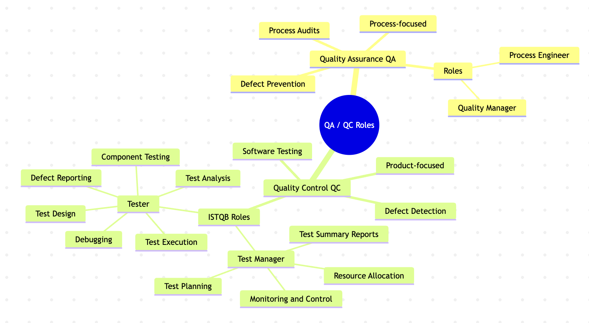
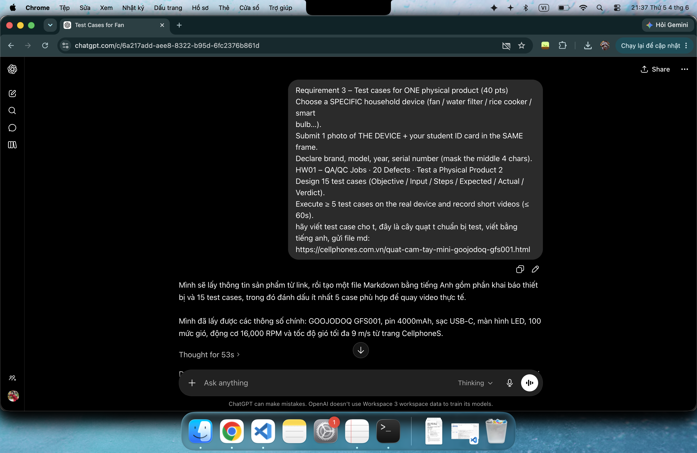
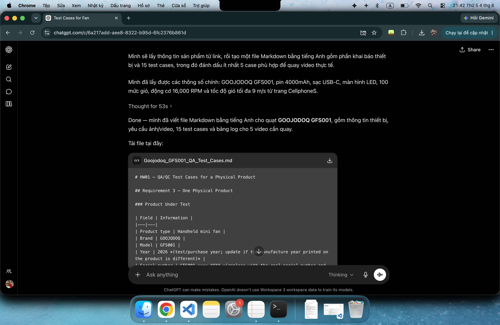
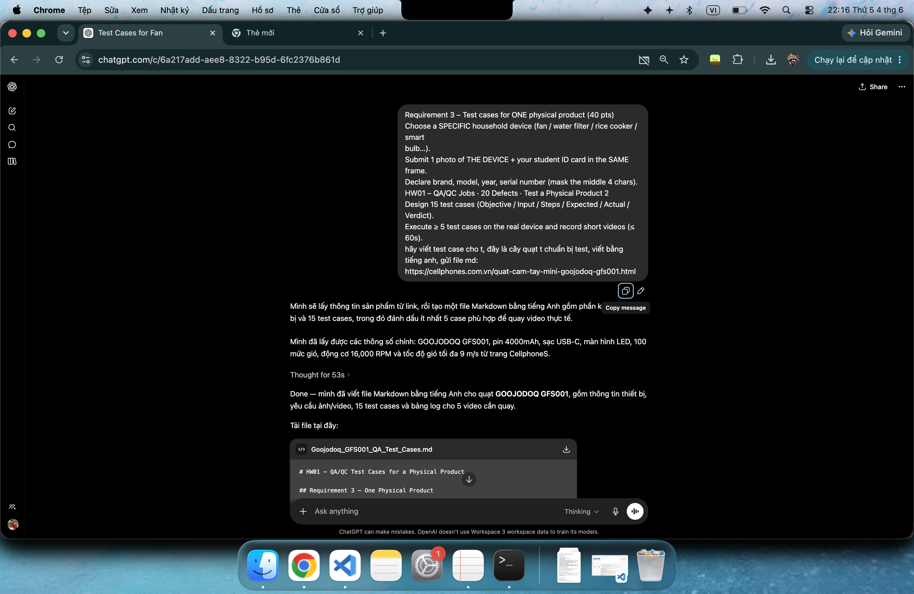
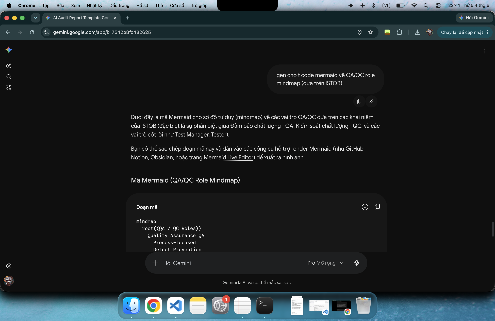
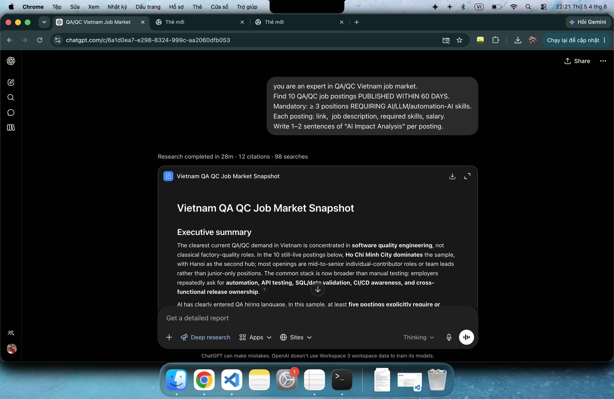
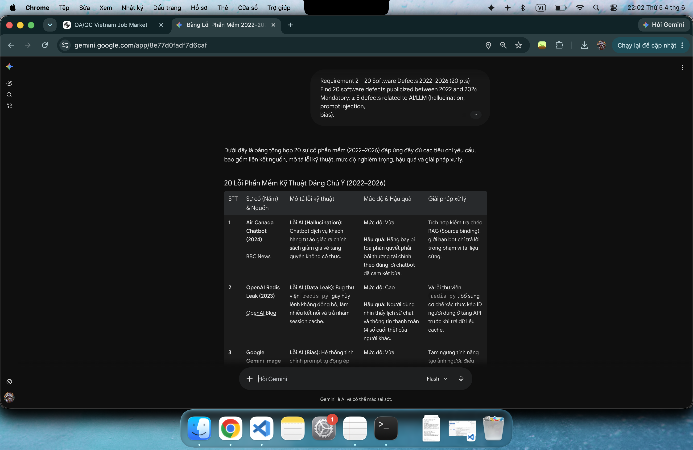
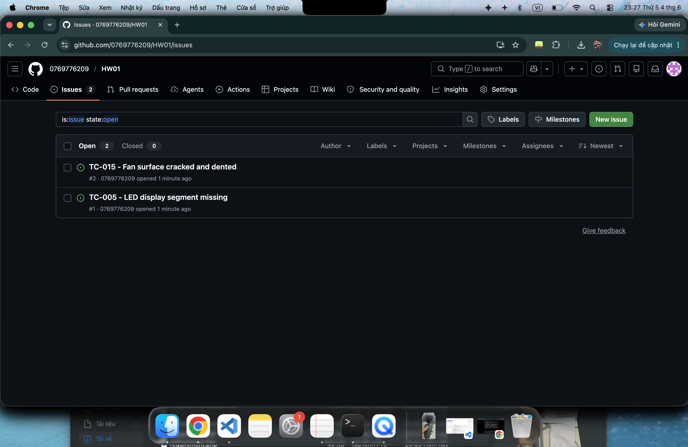
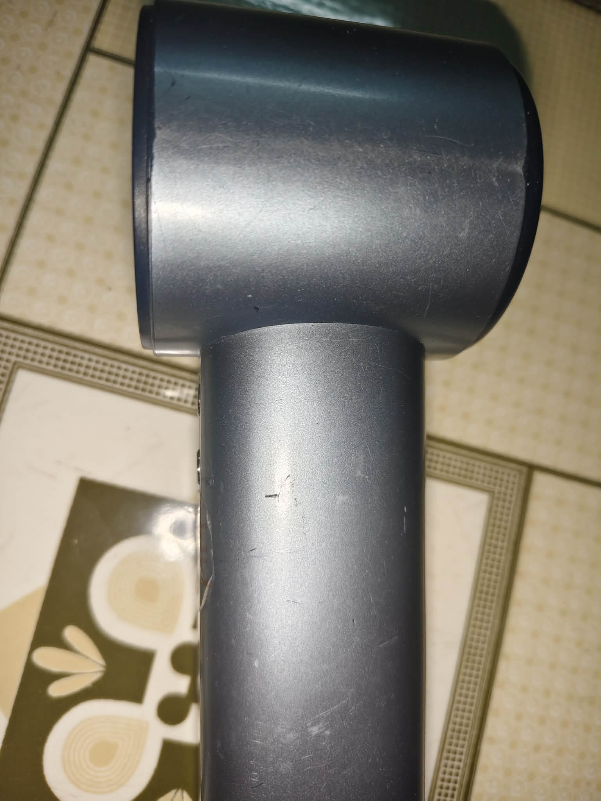

# Report HW01
**Student Name:** Lee Kun Da  
**Student ID:** 23127035

## Requirement 1

### 🍕 Pizza 4P’s — [HCM] QA Automation Engineer

* **Context:** Posted 2026-05-19 | Deadline: 2026-06-18 | Official career page.
* **Core Focus:** Enforce product reliability through structured QC and test automation across web, mobile, API, desktop, and device-level systems.
* **Requirements:** Degree in CS/IT; 2+ years QA/QC; Selenium, Cypress, TestNG, Appium, or JUnit; Python, Java, or JS; API & SQL validation; CI/CD workflows.
* **Salary:** Negotiate
* **Screen shot:**
* 
* **AI Impact:** Even non-software-native companies are moving toward Quality Engineering. Career growth depends heavily on turning manual regression into reusable automation.

### 🤖 Zen8Labs — Software QA Engineer (AI-first mindset)

* **Context:** Posted 2026-05-30 | Deadline: Unspecified | ITviec.
* **Core Focus:** Use AI/Agentic AI tools to accelerate test analysis, generate/validate scenarios, improve coverage, and perform AI-assisted defect analysis.
* **Requirements:** 4+ years software testing; experience with complex distributed systems; Selenium, Playwright, Cypress, or Robot Framework; JS, Java, or Python; fluency in Cursor, Claude, Copilot, or ChatGPT.
* **Salary:** up to $2000
* **Screen shot:**

* **AI Impact:** Shifting from standard automation to AI-augmented quality engineering. Senior testers must now know how to validate AI-generated tests and integrate them into production lifecycles.

### 💾 Nakivo — Automation QA Engineer

* **Context:** Posted 2026-05-21 | Deadline: Unspecified | ITviec.
* **Core Focus:** Collaborate with devs to design, create, and manage automated scripts and test cases leveraging AI technologies.
* **Requirements:** Degree in CS/Engineering; 3+ years in QA/automation roles; Java, Python, or C#; Selenium, Appium, Git; hands-on with Copilot, Cursor, or Perplexity.
* **Salary:** up to $1100 - $1500
* **Screen shot:**

* **AI Impact:** AI is treated as a core component of the automation stack rather than a bonus skill, widening the compensation gap between manual and automation talent.

### 🚚 Ahamove — Lead QC Engineer (Automation & Gen AI)

* **Context:** Posted 2026-05-21 | Deadline: Unspecified | ITviec.
* **Core Focus:** Spearhead the transition into AI-augmented QE. Build prompt libraries, deploy AI agents, utilize Claude Code, inject AI insights into CI/CD (GitLab/Jenkins), and develop LLM-based self-healing testing layers.
* **Requirements:** 5–7 years QA/QC (2+ years in leadership); Expert Python, JS, TS, or Java; Playwright, Cypress, Selenium; Docker, K8s, and cloud-native architecture.
* **Salary:** Negotiate
* **Screen shot:**

* **AI Impact:** Represents the highest tier of market shift where QA functions are entirely rebuilt around LLMs and agentic coding, transforming hiring filters and promotion criteria.

### 📊 Nakivo — QA Team Lead

* **Context:** Posted 2026-05-29 | Deadline: Unspecified | ITviec.
* **Core Focus:** Release-quality ownership, team mentoring, KPI/process design, and introducing AI-assisted QA workflows where they provide measurable value.
* **Requirements:** 6+ years in testing with 3+ years in a lead role; advanced test automation and regression strategies; risk-based early testing.
* **Salary:** $2500 - $3000
* **Screen shot:**

* **AI Impact:** QA leadership roles now expect pragmatic AI governance—knowing when AI genuinely enhances release confidence versus using it indiscriminately.

### 🏢 KMS Technology — Senior Manual Test Engineer (QA/QC)

* **Context:** HCMC or Da Nang | Posted 2026-05-25 | Deadline: Unspecified | ITviec.
* **Core Focus:** End-to-end product testing, sprint planning, customer collaboration, and mentoring junior engineers.
* **Requirements:** 5+ years of manual testing depth (exploratory, risk-based, STLC); intermediate English; Nice-to-have: test automation and daily use of AI tools (Copilot, Cursor, Claude Code).
* **Salary:** Negotiate
* **Screen shot:**

* **AI Impact:** Even strictly manual senior roles now reward AI tool fluency as a productivity multiplier for scenario generation, while humans retain heavy judgment ownership.

### 💳 Ingenico Vietnam — QA Engineer (Manual/ Automation)

* **Context:** Posted 2026-05-27 | Deadline: Unspecified | ITviec.
* **Core Focus:** Automate Android and web features, build reusable automation frameworks from scratch using Python/OOP, and coordinate with stakeholders.
* **Requirements:** 5+ years in QA; strong English skills; expertise in Robot Framework, Serenity, Katalon, Cypress, Appium, or Selenium; CI/CD pipeline integration.
* **Salary:** $1000 - $3000
* **Screen shot:**

* **AI Impact:** Demonstrates that top-tier base salaries are still commanded by strong fundamental framework-building capabilities, which act as the prerequisite foundation before layering on AI tools.

### 💎 PNJ — Senior QC (Automation Tester)

* **Context:** Posted 2026-05-20 | Deadline: Unspecified | ITviec.
* **Core Focus:** Validate both traditional and AI-driven features, evaluate LLM outputs (accuracy, fairness, reliability), use synthetic data, and monitor long-term model performance.
* **Requirements:** Senior automation profile; API and A/B testing; CI/CD maintenance; data quality awareness (completeness, privacy handling).
* **Salary:** $1000 - $1500
* **Screen shot:**

* **AI Impact:** Proves that AI testing is no longer niche to tech startups; mainstream enterprise retail tech is actively hiring engineers to police AI ethics and data quality.

### 🧬 Gene Solutions — Software Tester (QA QC, SQL)

* **Context:** Posted 2026-05-28 | Deadline: Unspecified | ITviec.
* **Core Focus:** Functional, UI, and role-based web testing; write test cases; run database validations using SQL; execute basic API testing via Postman.
* **Requirements:** 1–3 years of manual QC experience; intermediate SQL and Postman skills; English reading proficiency. Automation is a plus.
* **Salary:** Negotiate
* **Screen shot:**

* **AI Impact:** Represents the traditional entry-to-mid tier entry point. Highly vulnerable to AI compression; career progression relies heavily on adopting automation or AI-assisted tooling quickly.

### 🌐 FPT Software — Process Quality Assurance (PQA)

* **Context:** Posted 2026-05-30 | Deadline: Unspecified | ITviec.
* **Core Focus:** Audit project-process compliance, ensure system standards (CMMi), compile quality metrics, and manage delivery readiness reports.
* **Requirements:** Heavy data analysis skills; Excel mastery; cross-functional communication under pressure; IELTS 7.0 (or equiv) and Japanese N2.
* **Salary:** Negotiate
* **Screen shot:**

* **AI Impact:** Highlights the non-code branch of QA. While decoupled from automated testing scripts, these governance roles require tech and data literacy to effectively audit AI-driven engineering teams.

### AI Tool QA/QC Role Mindmap and 3 Mistakes Found

**Mindmap:** 

**Three mistakes I found in the AI mindmap:**
1. Debugging belongs to Developers, not Testers:
Testers only find and report bugs. Finding the cause of the bug and fixing the code is the job of developers.

1. Component testing is usually done by Developers:
Component (or Unit) testing is done by developers when they write code. Testers usually start at higher levels, like System testing.

1. Mixed-up categories:
The main topic is "QA / QC Roles" (People), but the map mixes people (Tester, Manager) with actions (Defect Detection, Audits). It makes the map confusing.

## Requirement 2

Below is a compiled list of 20 notable software defects from 2022 to 2026. The first 7 entries are AI/LLM-related incidents. The mandatory requirement for identifying an AI bias/hallucination blind spot when explaining the defect is integrated into the final column for all 20 entries.

| No. | Incident (Year) & Source | Software Defect & Consequences | Severity & Solution | AI Blind Spot (Hallucination/Bias in Explanation) |
| :--- | :--- | :--- | :--- | :--- |
| 1 | **Air Canada Chatbot** (2024) [washingtonpost](https://www.washingtonpost.com/travel/2024/02/18/air-canada-airline-chatbot-ruling/) | **Defect:** AI Chatbot hallucinated a non-existent bereavement fare policy. **Consequences:** The court ordered the airline to honor the refund promised by the bot. | **Severity:** Medium **Solution:** Integrate RAG cross-checking and implement source-binding for outputs. | AI often hallucinates that this chatbot was running on GPT-4, even though the core infrastructure was never publicly disclosed. |
| 2 | **OpenAI Redis Leak** (2023) [OpenAI Blog](https://openai.com/index/march-20-chatgpt-outage/) | **Defect:** Bug in the open-source `redis-py` library causing cached data to be returned to the wrong users. **Consequences:** Leakage of users' chat histories and payment information. | **Severity:** High **Solution:** Patch the Redis library, add explicit user ID verification at the caching layer. | AI frequently exaggerates that full credit card numbers were stolen (in reality, only the last 4 digits were exposed). |
| 3 | **Google Gemini Image** (2024) [Google Blog](https://blog.google/products-and-platforms/products/gemini/gemini-image-generation-issue/) | **Defect:** System prompt heavily forced "diversity" into all image generation queries. **Consequences:** Generated severe historical inaccuracies in images. | **Severity:** Medium **Solution:** Temporarily disabled human image generation, fine-tuned safety weights. | AI exhibits self-protective bias, often explaining this as a "cultural misunderstanding" rather than acknowledging the hardcoded prompt issue by engineers. |
| 4 | **Copilot Studio SSRF** (2024) [Tenable](https://www.tenable.com/blog/ssrfing-the-web-with-the-help-of-copilot-studio) | **Defect:** Server-Side Request Forgery (SSRF) vulnerability via prompt injection. **Consequences:** Allowed unauthorized access to Microsoft's internal Azure infrastructure. | **Severity:** High **Solution:** Patched the SSRF vulnerability, blocked routing to internal IPs. | AI often hallucinates that black-hat hackers successfully stole terabytes of data, whereas it was actually reported by white-hat security researchers. |
| 5 | **Chevy Tahoe Bot** (2023) [Prompt Security](https://www.upworthy.com/prankster-tricks-a-gm-dealership-chatbot-to-sell-him-a-76000-chevy-tahoe-for-ex1/) | **Defect:** Chatbot lacked guardrails and was manipulated into adopting legal personas. **Consequences:** The bot agreed to sell a Chevrolet Tahoe for $1, sparking a media frenzy. | **Severity:** Low **Solution:** Removed the chatbot from the website, reconfigured keyword filters for negotiations. | AI frequently hallucinates that the customer sued and actually purchased the vehicle for $1 under a binding contract. |
| 6 | **NYC MyCity Bot** (2024) [StateScoop](https://statescoop.com/mamdani-kill-nyc-ai-chatbot/) | **Defect:** RAG system extracted information out of context from legal documents. **Consequences:** Advised businesses to violate labor laws (e.g., withholding employee tips). | **Severity:** High **Solution:** Disabled the chatbot, updated the strict legal database constraints. | AI exhibits political bias, often directly blaming the Mayor of New York instead of analyzing the breakdown in the RAG pipeline. |
| 7 | **DPD Chatbot** (2024) [UpWorthy](https://www.upworthy.com/prankster-tricks-a-gm-dealership-chatbot-to-sell-him-a-76000-chevy-tahoe-for-ex1/) | **Defect:** A system update accidentally removed flags blocking negative behavior. **Consequences:** The bot swore at customers and wrote poetry criticizing DPD's own service. | **Severity:** Low **Solution:** Rolled back to the previous version, re-established system prompts. | AI hallucinates and generates entirely fake swear-filled poems that differ from the original poem written by the DPD bot. |
| 8 | **CrowdStrike BSOD** (2024) [CrowdStrike](https://www.crowdstrike.com/en-us/blog/falcon-content-update-preliminary-post-incident-report/) | **Defect:** Logic error in Channel 291 configuration file bypassed CI/CD testing. **Consequences:** 8.5 million Windows PCs crashed (BSOD), causing global aviation paralysis. | **Severity:** Critical **Solution:** Boot into Safe Mode to manually delete the file, update internal testing protocols. | AI often hallucinates that this incident was a massive malware cyberattack launched by a hostile nation-state. |
| 9 | **XZ Utils Backdoor** (2024) [NVD](https://nvd.nist.gov/vuln/detail/CVE-2024-3094) | **Defect:** Malicious code hidden in the `liblzma` compression library creating an SSH backdoor (CVE-2024-3094). **Consequences:** Narrowly avoided compromising RCE on Linux systems globally. | **Severity:** Critical **Solution:** Downgraded XZ to a safe version, rebuilt OS packages. | AI fabricates that this backdoor was activated and destroyed millions of servers, whereas it was actually intercepted before deployment. |
| 10 | **MoveIT Zero-Day** (2023) [NVD](https://nvd.nist.gov/vuln/detail/CVE-2023-34362) | **Defect:** SQL Injection vulnerability in the MoveIT Transfer application (CVE-2023-34362). **Consequences:** The Cl0p ransomware gang stole sensitive data from thousands of organizations. | **Severity:** Critical **Solution:** Applied immediate security patches, scanned for Web Shells (like LEMURLOOT). | AI hallucinates that this was an "AI-generated bug" due to interference from the 2023 AI hype cycle. |
| 11 | **AT&T Outage** (2024) [FCC Report](https://docs.fcc.gov/public/attachments/DOC-404150A1.pdf) | **Defect:** Incorrect execution of an equipment configuration script during network expansion. **Consequences:** Millions of devices lost service, interrupting 911 emergency calls. | **Severity:** High **Solution:** Rolled back the network script to the previous stable state. | AI hallucinates that the network outage was caused by a solar flare occurring coincidentally that morning. |
| 12 | **FAA NOTAM** (2023) [Wikipedia](https://en.wikipedia.org/wiki/2023_FAA_system_outage) | **Defect:** A contractor engineer accidentally deleted a critical database synchronization file. **Consequences:** A ground stop halted all flights across U.S. airspace for several hours. | **Severity:** High **Solution:** Initiated the backup system, added a delay to the DB synchronization mechanism. | AI hallucinates that the U.S. aviation system was still running on the outdated Windows 95 operating system at the time. |
| 13 | **UK NATS System** (2023) [Wikipedia](https://en.wikipedia.org/wiki/2023_United_Kingdom_air_traffic_control_failure) | **Defect:** Software automatically crashed (fail-safe) due to an inability to parse duplicate waypoints. **Consequences:** Over 1,500 flights were canceled in the UK. | **Severity:** High **Solution:** Updated the software source code to ignore faulty waypoint exceptions. | AI hallucinates that aircraft in the sky lost radar connection, while in reality, only the ground-based flight planning system failed. |
| 14 | **Spring4Shell** (2022) [NVD](https://nvd.nist.gov/vuln/detail/CVE-2022-22965) | **Defect:** RCE via the data binding feature of the Spring Framework (CVE-2022-22965). **Consequences:** Global red alert over the risk of Java servers being compromised. | **Severity:** High **Solution:** Updated the Spring Framework to version 5.3.18 or newer. | AI hallucinates that this bug affected all Java applications, whereas it primarily triggered in JDK 9+ environments running Tomcat. |
| 15 | **Fortinet SSL-VPN** (2022) [NVD](https://nvd.nist.gov/vuln/detail/CVE-2022-42475) | **Defect:** Heap-based Buffer Overflow vulnerability (CVE-2022-42475). **Consequences:** Attackers gained unauthenticated RCE on firewall devices. | **Severity:** Critical **Solution:** Upgraded FortiOS to the emergency patched version. | AI hallucinates that hackers used AI to generate the payload for this buffer overflow attack. |
| 16 | **Citrix Bleed** (2023) [NVD](https://nvd.nist.gov/vuln/detail/CVE-2023-4966) | **Defect:** Buffer Over-read on Citrix NetScaler (CVE-2023-4966). **Consequences:** Leaked session tokens, bypassing MFA to access internal networks. | **Severity:** Critical **Solution:** Updated the software and forcefully terminated all active sessions. | AI often mistakes "Citrix Bleed" for the name of a Ransomware strain rather than a memory leak vulnerability. |
| 17 | **F5 BIG-IP RCE** (2022) [NVD](https://nvd.nist.gov/vuln/detail/CVE-2022-1388) | **Defect:** Authentication bypass on the REST API (CVE-2022-1388). **Consequences:** Allowed attackers to gain root access to networking devices of major corporations. | **Severity:** Critical **Solution:** Installed the patch, blocked internet access to the iControl REST interface. | AI exhibits bias by concluding that this bug only affected banking systems, ignoring other sectors. |
| 18 | **Ivanti VPN** (2024) [NVD](https://nvd.nist.gov/vuln/detail/CVE-2023-46805) | **Defect:** Authentication Bypass vulnerability on Ivanti Connect Secure (CVE-2023-46805). **Consequences:** Hackers installed web shells to steal enterprise configurations and data. | **Severity:** High **Solution:** Imported an emergency XML mitigation file, performed a factory reset. | AI hallucinates that exploiting this vulnerability required the hacker to have direct physical access to the hardware server. |
| 19 | **Cisco IOS XE** (2023) [NVD](https://nvd.nist.gov/vuln/detail/CVE-2023-20198) | **Defect:** Privilege Escalation via the Web UI interface (CVE-2023-20198). **Consequences:** Over 40,000 Cisco devices were compromised and implanted with backdoors. | **Severity:** Critical **Solution:** Disabled the HTTP/HTTPS server feature on Cisco networking devices. | AI hallucinates and promotes a conspiracy theory that Cisco intentionally installed this backdoor into the OS. |
| 20 | **Palo Alto PAN-OS** (2024) [NVD](https://nvd.nist.gov/vuln/detail/CVE-2024-3400) | **Defect:** Command Injection in the GlobalProtect feature (CVE-2024-3400). **Consequences:** Allowed unauthenticated remote code execution with root privileges on the firewall. | **Severity:** Critical **Solution:** Installed the PAN-OS patch, temporarily disabled the Telemetry feature. | AI hallucinates that the firewall was bypassed using SQL Injection techniques rather than an OS Command Injection vulnerability. |

## Requirement 3 – One Physical Product

### Product Under Test

| Field | Information |
|---|---|
| Product type | Handheld mini fan |
| Brand | GOOJODOQ |
| Model | GFS001 |
| Year | 2024 |
| Main power source | Rechargeable lithium-ion battery |
| Battery capacity | 4000 mAh |
| Charging port | USB Type-C |
| Key features | LED digital display, 100 adjustable fan speed levels, brushless turbo motor, handheld/desktop use |

### Photo Evidence Requirement

Submit **1 photo** showing the **GOOJODOQ GFS001 fan and student ID card in the same frame**.

[PHYSICAL DEVICE + STUDENT CARD](./minhchung.png)

### Video Evidence Requirement

Execute at least **5 test cases** on the real device and record short videos, each **60 seconds or less**.

Recommended test cases to record: **TC-001, TC-002, TC-003, TC-004, TC-005**.

---

## Test Environment

| Item | Description |
|---|---|
| Tester | Lee Kun Da |
| Location | Indoor room |
| Ambient condition | Normal room temperature, dry surface |
| Test date | 4/6/2026 |
| Required tools | USB-C cable, tissue paper, phone camera |

---

## Test Cases

| Test Case ID | Objective | Input / Test Data | Steps | Expected Result | Actual Result | Verdict |
|---|---|---|---|---|---|---|
| TC-001 | Verify that the fan powers on correctly. | Fan with battery charged above 20%. | 1. Hold the fan normally.   2. Press the power button once.   3. Observe the fan blade and LED display. | Fan turns on, blade starts spinning, and LED display shows battery/speed information. | Fan turned on; LED displayed info | Pass |
| TC-002 | Verify that the fan powers off correctly. | Fan is already running. | 1. Turn on the fan.   2. Press and hold or press the power button according to normal usage.   3. Observe the fan blade and display. | Fan stops spinning and the LED display turns off. | Fan turned off vs blade stopped | Pass |
| TC-003 | Verify that fan speed can be increased. | Fan is turned on at a low speed level. | 1. Turn on the fan.   2. Press the speed increase button several times.   3. Observe airflow, sound, and LED speed value. | Speed value increases on the LED display and airflow becomes stronger. | Speed increased; airflow became stronger | Pass |
| TC-004 | Verify that fan speed can be decreased. | Fan is turned on at a high speed level. | 1. Set fan to a higher speed.   2. Press the speed decrease button several times.   3. Observe airflow, sound, and LED speed value. | Speed value decreases on the LED display and airflow becomes weaker. | Speed decreased; airflow weaker | Pass |
| TC-005 | Verify that the LED display shows clearly. | Fan powered on, battery not empty. | 1. Turn on the fan.   2. Change speed level.   3. Observe the LED display. | LED display clearly shows fan speed or battery status in real time. | One segment of the LED display is missing | Fail |
| TC-006 | Verify USB Type-C charging function. | USB-C cable vs laptop as battery source | 1. Connect USB-C cable to the fan.   2. Connect the other end to the laptop.   3. Observe LED charging indication. | Fan enters charging mode and LED shows charging/battery status. | Fan charged; LED showed status | Pass |
| TC-007 | Verify that the fan can operate while placed on a flat surface. | Flat surface. | 1. Place the fan upright on a desk.   2. Turn on the fan at medium speed.   3. Observe stability. | Fan remains stable and does not fall over or move excessively. | Fan stayed stable | Pass |
| TC-008 | Verify handheld comfort during operation. | Fan running at medium speed. | 1. Hold the fan for 1 minute.   2. Check grip comfort, vibration, and heat. | Fan is comfortable to hold, with no heat. | Comfortable; no heat | Pass |
| TC-009 | Verify airflow at a short distance. | Tissue paper and ruler. | 1. Turn fan to medium speed.   2. Hold tissue paper 30 cm from the fan outlet.   3. Observe tissue movement. | Tissue paper moves clearly, showing that airflow is produced at short distance. | Tissue moved clearly at 30 cm. | Pass |
| TC-010 | Verify airflow at a longer distance. | Tissue paper and measuring tape. | 1. Turn fan to high speed.   2. Place tissue paper about 1 meter from the fan outlet.   3. Observe tissue movement. | Tissue paper moves slightly or clearly, showing airflow can reach the longer distance. | Tissue moved at about 1 m | Pass |
| TC-011 | Verify abnormal noise during operation. | Quiet indoor environment. | 1. Turn on fan at low speed.   2. Increase to medium speed.   3. Increase to high speed.   4. Listen for rattling, scraping, or clicking sounds. | Fan produces normal motor/wind noise only; no rattling, scraping, or unstable sound. | Normal wind noise only | Pass |
| TC-012 | Verify that the protective grille prevents direct finger contact with the blade during normal use. | Fan turned off first, then on. | 1. Visually inspect the air outlet grille.   2. Do not insert fingers or objects into the fan.   3. Turn on the fan and observe grille stability. | Grille is firmly attached and prevents normal accidental contact with the spinning blade. | Grille was firm and safe | Pass |
| TC-013 | Verify device response when battery is low. | Fan battery below 10%. | 1. Use the fan until battery becomes low.   2. Observe LED display and fan behavior. | LED shows low battery or fan speed decreases/stops safely without sudden abnormal behavior. | Low battery behavior was safe | Pass |
| TC-014 | Verify charging cable fit and port stability. | USB-C cable. | 1. Insert USB-C cable into the charging port.   2. Gently move the cable left/right without force.   3. Observe connection stability. | Cable fits properly, does not fall out easily, and charging indication remains stable. | USB-C cable fit firmly | Pass |
| TC-015 | Verify exterior build quality. | Visual and touch inspection. | 1. Inspect the fan body, buttons, display, grille, and handle.   2. Check for cracks, loose parts, scratches, sharp edges, or misalignment. | Product has no major cosmetic defect, no loose part, no sharp edge, and buttons are properly aligned. | Fan surface is cracked and dented  | Fail |

---

## Executed Test Case Evidence Log

| Test Case ID | Video Filename | Duration | Actual Result Summary | Verdict |
|---|---|---:|---|---|
| TC-001 | [link](https://youtube.com/shorts/t0WQLlVMuxU) | ≤ 60s | Fan turned on; LED displayed info. | Pass |
| TC-002 | [link](https://youtube.com/shorts/S9IPc6Baanw?feature=share) | ≤ 60s | Fan turned off; blade stopped. | Pass |
| TC-003 | [link](https://youtube.com/shorts/9LDMiMjouaU) | ≤ 60s | Speed increased; airflow stronger. | Pass |
| TC-004 | [link](https://youtube.com/shorts/4S4EsrKwy_0) | ≤ 60s | Speed decreased; airflow weaker. | Pass |
| TC-005 | [link](https://youtube.com/shorts/3NVAcsE9Nhg) | ≤ 60s | LED showed not clearly. | Fail |

---

## AI Missed Edge Cases

**AI conversation screenshot requirement:** 
Output evidence that AI did not generate this section
(the prompt I did not tell AI to generate include edge cases)

[md file that AI send me](./Goojodoq_GFS001_QA_Test_Cases.md)

- Pressing `+` and `-` very fast.
- Plugging the charger while the fan is already running.
- Pressing buttons when the physical switch is off.

These cases are important because real users may use the fan quickly, charge it during operation, or keep it inside a bag

**explanation:**  
AI missed these cases because it only focused on normal feature tests and some happy paths. It did not think about edge cases: fast press actions, charging during use or storage safety. Maybe because of AI is lack of human experience so it cannot cover those cases.

## Notes for Submission

1. Replace the serial number placeholder with the real serial number and mask the middle 4 characters.  
   Example: `GF25-****-0198`.
2. Add the real photo of the fan and student ID card in the same frame.
3. Record at least 5 videos, each 60 seconds or less.
4. Fill in the **Actual Result** and **Verdict** columns after testing.
5. Do not claim a test case passed unless it was executed on the real device.

---

## Appendix A - AI Audit Report

| Item | Content |
|---|---|
| (1) Prompt + tool | **Tool:** ChatGPT **Timestamp:** `[8:19 4/6/2026]` **Prompt:** "Requirement 3 – Test cases for ONE physical product (40 pts) Choose a SPECIFIC household device (fan / water filter / rice cooker / smart bulb…). Submit 1 photo of THE DEVICE + your student ID card in the SAME frame. Declare brand, model, year, serial number (mask the middle 4 chars). HW01 – QA/QC Jobs · 20 Defects · Test a Physical Product 2 Design 15 test cases (Objective / Input / Steps / Expected / Actual / Verdict). Execute ≥ 5 test cases on the real device and record short videos (≤ 60s). hãy viết test case cho t, đây là cây quạt t chuẩn bị test, viết bằng tiếng anh, gửi file md: [https://cellphones.com.vn/quat-cam-tay-mini-goojodoq-gfs001.html](https://cellphones.com.vn/quat-cam-tay-mini-goojodoq-gfs001.html)" |
| (2) AI output |  [requirement 3 template md AI sent](./Goojodoq_GFS001_QA_Test_Cases.md)|
| (3) Verdict | **INCOMPLETE** |
| (4) Reasoning | The AI gave useful basic test cases for the fan, but it mostly focused on normal use. It missed some edge cases, so the coverage was not enough for real-device testing. |
| (5) Student fix | I added the missing edge cases: pressing `+` and `-` very fast, plugging charger while the fan is running, and pressing buttons when the switch is off. |

| Item | Content |
|---|---|
| (1) Prompt + tool | **Tool:** Gemini **Timestamp:** `[7:59 4/6/2026]` **Prompt:** "gen cho t code mermaid vẽ QA/QC role mindmap (dựa trên ISTQB)" |
| (2) AI output | |
| (3) Verdict | **INCOMPLETE** |
| (4) Reasoning | put debugging under testers, said component testing is usually tester work, and mixed roles with activities. |
| (5) Student fix | I corrected the mindmap by moving debugging and component testing to developers. I also separated QA/QC roles from QA/QC activities. |

| Item | Content |
|---|---|
| (1) Prompt + tool | **Tool:** ChatGPT **Timestamp:** `[12:15 1/6/2026]` **Prompt:** "you are an expert in QA/QC Vietnam job market. Find 10 QA/QC job postings PUBLISHED WITHIN 60 DAYS. Mandatory: ≥ 3 positions REQUIRING AI/LLM/automation-AI skills. Each posting: link,  job description, required skills, salary. Write 1–2 sentences of AI Impact Analysis per posting." |
| (2) AI output | |
| (3) Verdict | **VALID** |
| (4) Reasoning | Requirement 1 was mostly good. The AI found suitable QA/QC job information and the content matched the job-market requirement. I did not find any big mistake in this part. |
| (5) Student fix | I reviewed the jobs, added screenshots, and adjusted small wording in the report. No major correction was needed. |

| Item | Content |
|---|---|
| (1) Prompt + tool | **Tool:** Gemini **Timestamp:** `[12:31 1/6/]` **Prompt:** "Requirement 2 – 20 Software Defects 2022–2026 (20 pts) Find 20 software defects publicized between 2022 and 2026. Mandatory: ≥ 5 defects related to AI LLM (hallucination, prompt injection, bias). Each defect: source link, description, severity, consequences, solution." |
| (2) AI output | |
| (3) Verdict | **INCOMPLETE** |
| (4) Reasoning | Requirement 2 was useful, but some source links from the AI were dead. So, I could not use all AI sources directly. |
| (5) Student fix | I checked the links again and replaced dead links with other working article or official source links. I also edited the defect information to match the new sources. |

**AI accuracy ratio:** VALID `25%` (1/4), INVALID `0%` (0/4), INCOMPLETE `75%` (3/4).  
**Conclusion:** AI should be used for brainstorming, first drafts. It should not be used for final results or source links without human checking.

### GitHub Issues Evidence

Defects found during physical-device testing were logged as GitHub Issues.

()
Evidence of TC15 Fail

## Appendix B - AI Critique Draft

AI helped me make the report faster, but I still needed to check it. For Requirement 1, the job information was mostly good. But the mindmap had some mistakes, such as putting debugging under testers and saying component testing is usually tester work.

For Requirement 2, AI gave useful defect ideas, but some links were dead. I had to find other working sources. For Requirement 3, AI made normal fan test cases, but it missed edge cases like pressing `+` and `-` fast, charging while running, and pressing buttons when the switch is off.

I learned that AI is good for first draft and ideas. But I should not trust it fully. I still need to check links, fix wrong parts, and add my own testing ideas.

## Appendix C - Mandatory AI Disclosure

`Requirement 1, 2, 3 template` were initially generated with `Gemini vs ChatGPT`. Requirement 1 is fine. Requirement 2 contains some dead urls, so I have fixed those failed links. Requirement 3 template is mostly correct, so I just need to do testing and fill in the actual results. I also corrected the AI's QA/QC mindmap mistakes. The physical-device photo, execution videos, and final actual results were produced and verified by me. I confirm I did not use AI to generate any output listed in the prohibited category.

## Self-Assessment

| No. | Criteria | Max Grade | Self-Assessed Grade | Note |
|---|---|---:|---:|---|
| 1 | Job Market 2026+ (10 jobs × 3 pts + AI Impact) | 40 | 40 | 10 jobs included, AI impact written, screenshots added. Some job links/details may still need final checking. |
| 2 | Software Defects 2022-2026 (20 defects) | 20 | 18 | 20 defects included with AI blind spot. Some AI links were dead and replaced manually. |
| 3 | Physical-product test design (15 TCs + 5 videos) | 25 | 21 | 15 test cases, photo, actual results, and video evidence included. Edge cases are explained separately. |
| AI-1 | AI-02 AI Audit Report (5-section) attached | 8 | 7 | Audit report included for main AI artifacts, with verdict, reasoning, and student fix. |
| AI-2 | AI Critique 200-300 words + AI-03 Disclosure attached | 4 | 3 | Disclosure is included. AI critique is included but still simple and short. |
| AI-3 | AI-05 Checklist signed + anti-cheat artifacts | 3 | 1 | Main evidence files are included, but signed checklist/template files still need final attachment. |
| Total |  | 100 | 87 | Self-assessed grade: **091/100** |
