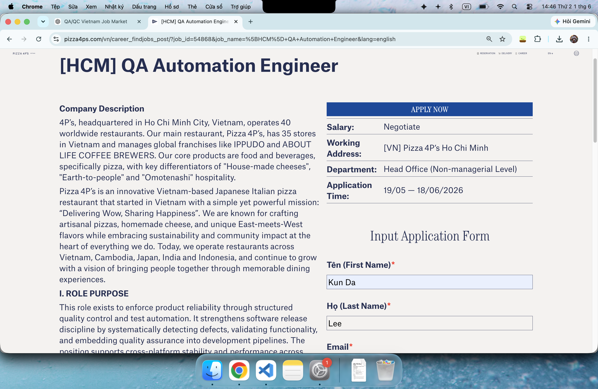
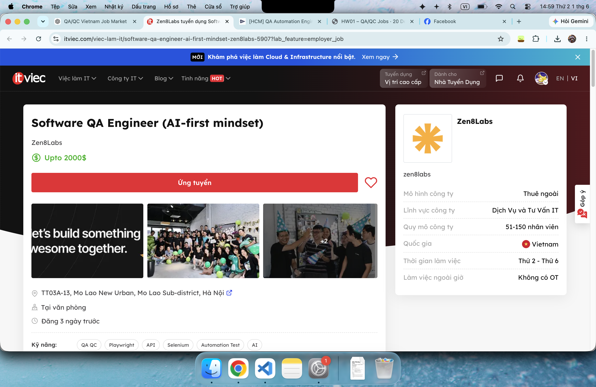
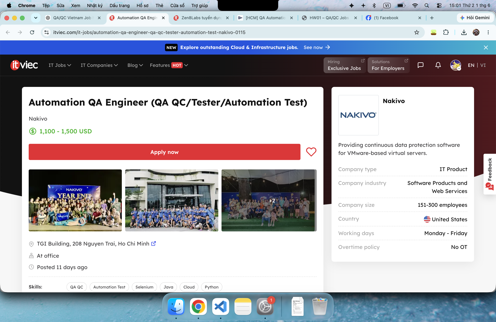
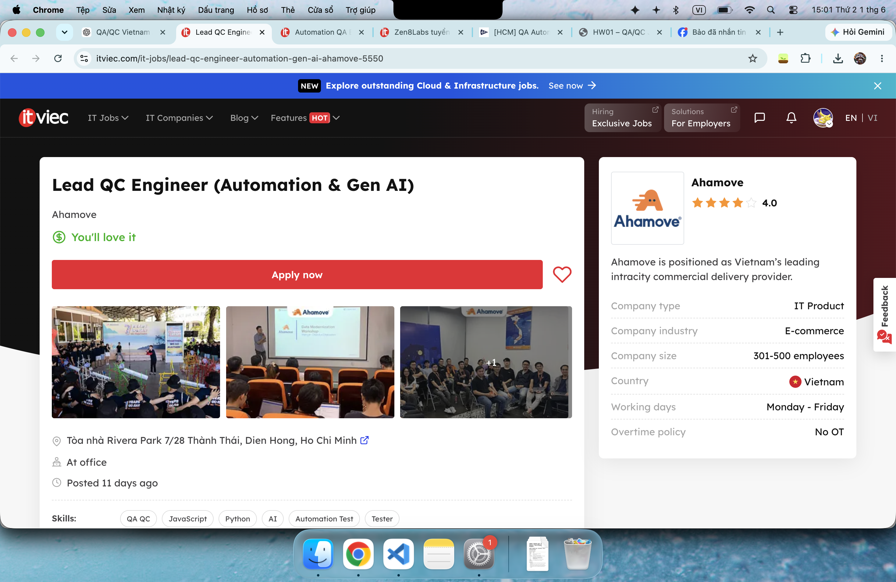
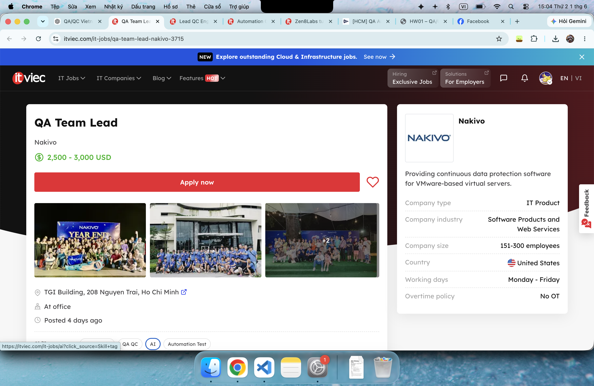
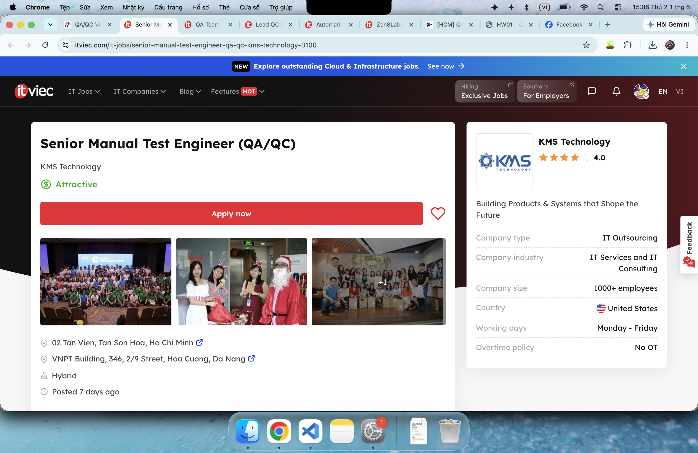
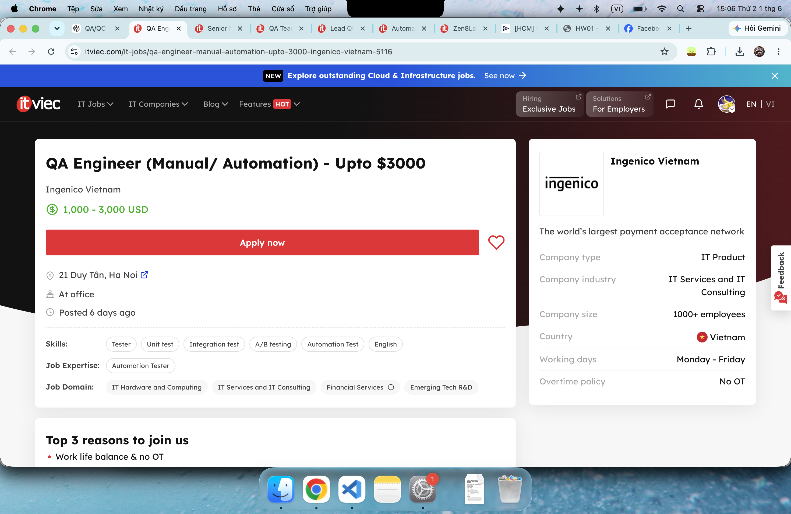
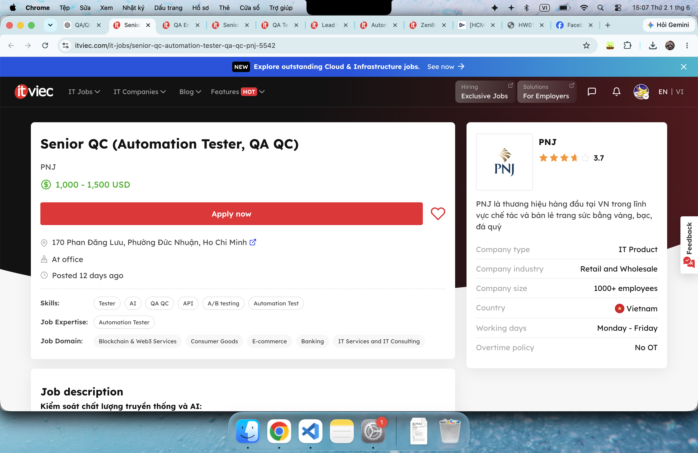
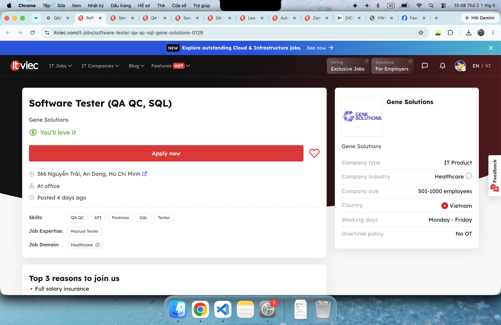
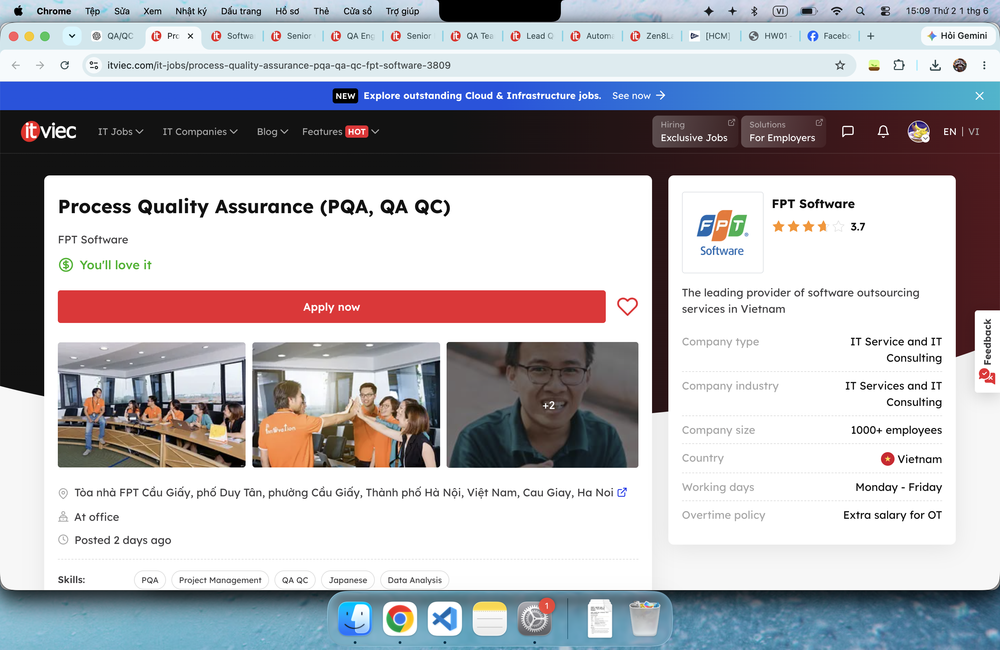

# Report HW01
**Student Name:** Lee Kun Da  
**Student ID:** 23127035

## Requirement 1

### 🍕 Pizza 4P’s — [HCM] QA Automation Engineer

* **Context:** Posted 2026-05-19 | Deadline: 2026-06-18 | Official career page.
* **Core Focus:** Enforce product reliability through structured QC and test automation across web, mobile, API, desktop, and device-level systems.
* **Requirements:** Degree in CS/IT; 2+ years QA/QC; Selenium, Cypress, TestNG, Appium, or JUnit; Python, Java, or JS; API & SQL validation; CI/CD workflows.
* **Salary:** Negotiate
* **Screen shot:**
* 
* **AI Impact:** Even non-software-native companies are moving toward Quality Engineering. Career growth depends heavily on turning manual regression into reusable automation.

### 🤖 Zen8Labs — Software QA Engineer (AI-first mindset)

* **Context:** Posted 2026-05-30 | Deadline: Unspecified | ITviec.
* **Core Focus:** Use AI/Agentic AI tools to accelerate test analysis, generate/validate scenarios, improve coverage, and perform AI-assisted defect analysis.
* **Requirements:** 4+ years software testing; experience with complex distributed systems; Selenium, Playwright, Cypress, or Robot Framework; JS, Java, or Python; fluency in Cursor, Claude, Copilot, or ChatGPT.
* **Salary:** up to $2000
* **Screen shot:**

* **AI Impact:** Shifting from standard automation to AI-augmented quality engineering. Senior testers must now know how to validate AI-generated tests and integrate them into production lifecycles.

### 💾 Nakivo — Automation QA Engineer

* **Context:** Posted 2026-05-21 | Deadline: Unspecified | ITviec.
* **Core Focus:** Collaborate with devs to design, create, and manage automated scripts and test cases leveraging AI technologies.
* **Requirements:** Degree in CS/Engineering; 3+ years in QA/automation roles; Java, Python, or C#; Selenium, Appium, Git; hands-on with Copilot, Cursor, or Perplexity.
* **Salary:** up to $1100 - $1500
* **Screen shot:**

* **AI Impact:** AI is treated as a core component of the automation stack rather than a bonus skill, widening the compensation gap between manual and automation talent.

### 🚚 Ahamove — Lead QC Engineer (Automation & Gen AI)

* **Context:** Posted 2026-05-21 | Deadline: Unspecified | ITviec.
* **Core Focus:** Spearhead the transition into AI-augmented QE. Build prompt libraries, deploy AI agents, utilize Claude Code, inject AI insights into CI/CD (GitLab/Jenkins), and develop LLM-based self-healing testing layers.
* **Requirements:** 5–7 years QA/QC (2+ years in leadership); Expert Python, JS, TS, or Java; Playwright, Cypress, Selenium; Docker, K8s, and cloud-native architecture.
* **Salary:** Negotiate
* **Screen shot:**

* **AI Impact:** Represents the highest tier of market shift where QA functions are entirely rebuilt around LLMs and agentic coding, transforming hiring filters and promotion criteria.

### 📊 Nakivo — QA Team Lead

* **Context:** Posted 2026-05-29 | Deadline: Unspecified | ITviec.
* **Core Focus:** Release-quality ownership, team mentoring, KPI/process design, and introducing AI-assisted QA workflows where they provide measurable value.
* **Requirements:** 6+ years in testing with 3+ years in a lead role; advanced test automation and regression strategies; risk-based early testing.
* **Salary:** $2500 - $3000
* **Screen shot:**

* **AI Impact:** QA leadership roles now expect pragmatic AI governance—knowing when AI genuinely enhances release confidence versus using it indiscriminately.

### 🏢 KMS Technology — Senior Manual Test Engineer (QA/QC)

* **Context:** HCMC or Da Nang | Posted 2026-05-25 | Deadline: Unspecified | ITviec.
* **Core Focus:** End-to-end product testing, sprint planning, customer collaboration, and mentoring junior engineers.
* **Requirements:** 5+ years of manual testing depth (exploratory, risk-based, STLC); intermediate English; Nice-to-have: test automation and daily use of AI tools (Copilot, Cursor, Claude Code).
* **Salary:** Negotiate
* **Screen shot:**

* **AI Impact:** Even strictly manual senior roles now reward AI tool fluency as a productivity multiplier for scenario generation, while humans retain heavy judgment ownership.

### 💳 Ingenico Vietnam — QA Engineer (Manual/ Automation)

* **Context:** Posted 2026-05-27 | Deadline: Unspecified | ITviec.
* **Core Focus:** Automate Android and web features, build reusable automation frameworks from scratch using Python/OOP, and coordinate with stakeholders.
* **Requirements:** 5+ years in QA; strong English skills; expertise in Robot Framework, Serenity, Katalon, Cypress, Appium, or Selenium; CI/CD pipeline integration.
* **Salary:** $1000 - $3000
* **Screen shot:**

* **AI Impact:** Demonstrates that top-tier base salaries are still commanded by strong fundamental framework-building capabilities, which act as the prerequisite foundation before layering on AI tools.

### 💎 PNJ — Senior QC (Automation Tester)

* **Context:** Posted 2026-05-20 | Deadline: Unspecified | ITviec.
* **Core Focus:** Validate both traditional and AI-driven features, evaluate LLM outputs (accuracy, fairness, reliability), use synthetic data, and monitor long-term model performance.
* **Requirements:** Senior automation profile; API and A/B testing; CI/CD maintenance; data quality awareness (completeness, privacy handling).
* **Salary:** $1000 - $1500
* **Screen shot:**

* **AI Impact:** Proves that AI testing is no longer niche to tech startups; mainstream enterprise retail tech is actively hiring engineers to police AI ethics and data quality.

### 🧬 Gene Solutions — Software Tester (QA QC, SQL)

* **Context:** Posted 2026-05-28 | Deadline: Unspecified | ITviec.
* **Core Focus:** Functional, UI, and role-based web testing; write test cases; run database validations using SQL; execute basic API testing via Postman.
* **Requirements:** 1–3 years of manual QC experience; intermediate SQL and Postman skills; English reading proficiency. Automation is a plus.
* **Salary:** Negotiate
* **Screen shot:**

* **AI Impact:** Represents the traditional entry-to-mid tier entry point. Highly vulnerable to AI compression; career progression relies heavily on adopting automation or AI-assisted tooling quickly.

### 🌐 FPT Software — Process Quality Assurance (PQA)

* **Context:** Posted 2026-05-30 | Deadline: Unspecified | ITviec.
* **Core Focus:** Audit project-process compliance, ensure system standards (CMMi), compile quality metrics, and manage delivery readiness reports.
* **Requirements:** Heavy data analysis skills; Excel mastery; cross-functional communication under pressure; IELTS 7.0 (or equiv) and Japanese N2.
* **Salary:** Negotiate
* **Screen shot:**

* **AI Impact:** Highlights the non-code branch of QA. While decoupled from automated testing scripts, these governance roles require tech and data literacy to effectively audit AI-driven engineering teams.

## Requirement 2

Below is a compiled list of 20 notable software defects from 2022 to 2026. The first 7 entries are AI/LLM-related incidents. The mandatory requirement for identifying an AI bias/hallucination blind spot when explaining the defect is integrated into the final column for all 20 entries.

| No. | Incident (Year) & Source | Software Defect & Consequences | Severity & Solution | AI Blind Spot (Hallucination/Bias in Explanation) |
| :--- | :--- | :--- | :--- | :--- |
| 1 | **Air Canada Chatbot** (2024) [washingtonpost](https://www.washingtonpost.com/travel/2024/02/18/air-canada-airline-chatbot-ruling/) | **Defect:** AI Chatbot hallucinated a non-existent bereavement fare policy. **Consequences:** The court ordered the airline to honor the refund promised by the bot. | **Severity:** Medium **Solution:** Integrate RAG cross-checking and implement source-binding for outputs. | AI often hallucinates that this chatbot was running on GPT-4, even though the core infrastructure was never publicly disclosed. |
| 2 | **OpenAI Redis Leak** (2023) [OpenAI Blog](https://openai.com/index/march-20-chatgpt-outage/) | **Defect:** Bug in the open-source `redis-py` library causing cached data to be returned to the wrong users. **Consequences:** Leakage of users' chat histories and payment information. | **Severity:** High **Solution:** Patch the Redis library, add explicit user ID verification at the caching layer. | AI frequently exaggerates that full credit card numbers were stolen (in reality, only the last 4 digits were exposed). |
| 3 | **Google Gemini Image** (2024) [Google Blog](https://blog.google/products-and-platforms/products/gemini/gemini-image-generation-issue/) | **Defect:** System prompt heavily forced "diversity" into all image generation queries. **Consequences:** Generated severe historical inaccuracies in images. | **Severity:** Medium **Solution:** Temporarily disabled human image generation, fine-tuned safety weights. | AI exhibits self-protective bias, often explaining this as a "cultural misunderstanding" rather than acknowledging the hardcoded prompt issue by engineers. |
| 4 | **Copilot Studio SSRF** (2024) [Tenable](https://www.tenable.com/blog/ssrfing-the-web-with-the-help-of-copilot-studio) | **Defect:** Server-Side Request Forgery (SSRF) vulnerability via prompt injection. **Consequences:** Allowed unauthorized access to Microsoft's internal Azure infrastructure. | **Severity:** High **Solution:** Patched the SSRF vulnerability, blocked routing to internal IPs. | AI often hallucinates that black-hat hackers successfully stole terabytes of data, whereas it was actually reported by white-hat security researchers. |
| 5 | **Chevy Tahoe Bot** (2023) [Prompt Security](https://www.upworthy.com/prankster-tricks-a-gm-dealership-chatbot-to-sell-him-a-76000-chevy-tahoe-for-ex1/) | **Defect:** Chatbot lacked guardrails and was manipulated into adopting legal personas. **Consequences:** The bot agreed to sell a Chevrolet Tahoe for $1, sparking a media frenzy. | **Severity:** Low **Solution:** Removed the chatbot from the website, reconfigured keyword filters for negotiations. | AI frequently hallucinates that the customer sued and actually purchased the vehicle for $1 under a binding contract. |
| 6 | **NYC MyCity Bot** (2024) [StateScoop](https://statescoop.com/mamdani-kill-nyc-ai-chatbot/) | **Defect:** RAG system extracted information out of context from legal documents. **Consequences:** Advised businesses to violate labor laws (e.g., withholding employee tips). | **Severity:** High **Solution:** Disabled the chatbot, updated the strict legal database constraints. | AI exhibits political bias, often directly blaming the Mayor of New York instead of analyzing the breakdown in the RAG pipeline. |
| 7 | **DPD Chatbot** (2024) [UpWorthy](https://www.upworthy.com/prankster-tricks-a-gm-dealership-chatbot-to-sell-him-a-76000-chevy-tahoe-for-ex1/) | **Defect:** A system update accidentally removed flags blocking negative behavior. **Consequences:** The bot swore at customers and wrote poetry criticizing DPD's own service. | **Severity:** Low **Solution:** Rolled back to the previous version, re-established system prompts. | AI hallucinates and generates entirely fake swear-filled poems that differ from the original poem written by the DPD bot. |
| 8 | **CrowdStrike BSOD** (2024) [CrowdStrike](https://www.crowdstrike.com/en-us/blog/falcon-content-update-preliminary-post-incident-report/) | **Defect:** Logic error in Channel 291 configuration file bypassed CI/CD testing. **Consequences:** 8.5 million Windows PCs crashed (BSOD), causing global aviation paralysis. | **Severity:** Critical **Solution:** Boot into Safe Mode to manually delete the file, update internal testing protocols. | AI often hallucinates that this incident was a massive malware cyberattack launched by a hostile nation-state. |
| 9 | **XZ Utils Backdoor** (2024) [NVD](https://nvd.nist.gov/vuln/detail/CVE-2024-3094) | **Defect:** Malicious code hidden in the `liblzma` compression library creating an SSH backdoor (CVE-2024-3094). **Consequences:** Narrowly avoided compromising RCE on Linux systems globally. | **Severity:** Critical **Solution:** Downgraded XZ to a safe version, rebuilt OS packages. | AI fabricates that this backdoor was activated and destroyed millions of servers, whereas it was actually intercepted before deployment. |
| 10 | **MoveIT Zero-Day** (2023) [NVD](https://nvd.nist.gov/vuln/detail/CVE-2023-34362) | **Defect:** SQL Injection vulnerability in the MoveIT Transfer application (CVE-2023-34362). **Consequences:** The Cl0p ransomware gang stole sensitive data from thousands of organizations. | **Severity:** Critical **Solution:** Applied immediate security patches, scanned for Web Shells (like LEMURLOOT). | AI hallucinates that this was an "AI-generated bug" due to interference from the 2023 AI hype cycle. |
| 11 | **AT&T Outage** (2024) [FCC Report](https://docs.fcc.gov/public/attachments/DOC-404150A1.pdf) | **Defect:** Incorrect execution of an equipment configuration script during network expansion. **Consequences:** Millions of devices lost service, interrupting 911 emergency calls. | **Severity:** High **Solution:** Rolled back the network script to the previous stable state. | AI hallucinates that the network outage was caused by a solar flare occurring coincidentally that morning. |
| 12 | **FAA NOTAM** (2023) [Wikipedia](https://en.wikipedia.org/wiki/2023_FAA_system_outage) | **Defect:** A contractor engineer accidentally deleted a critical database synchronization file. **Consequences:** A ground stop halted all flights across U.S. airspace for several hours. | **Severity:** High **Solution:** Initiated the backup system, added a delay to the DB synchronization mechanism. | AI hallucinates that the U.S. aviation system was still running on the outdated Windows 95 operating system at the time. |
| 13 | **UK NATS System** (2023) [Wikipedia](https://en.wikipedia.org/wiki/2023_United_Kingdom_air_traffic_control_failure) | **Defect:** Software automatically crashed (fail-safe) due to an inability to parse duplicate waypoints. **Consequences:** Over 1,500 flights were canceled in the UK. | **Severity:** High **Solution:** Updated the software source code to ignore faulty waypoint exceptions. | AI hallucinates that aircraft in the sky lost radar connection, while in reality, only the ground-based flight planning system failed. |
| 14 | **Spring4Shell** (2022) [NVD](https://nvd.nist.gov/vuln/detail/CVE-2022-22965) | **Defect:** RCE via the data binding feature of the Spring Framework (CVE-2022-22965). **Consequences:** Global red alert over the risk of Java servers being compromised. | **Severity:** High **Solution:** Updated the Spring Framework to version 5.3.18 or newer. | AI hallucinates that this bug affected all Java applications, whereas it primarily triggered in JDK 9+ environments running Tomcat. |
| 15 | **Fortinet SSL-VPN** (2022) [NVD](https://nvd.nist.gov/vuln/detail/CVE-2022-42475) | **Defect:** Heap-based Buffer Overflow vulnerability (CVE-2022-42475). **Consequences:** Attackers gained unauthenticated RCE on firewall devices. | **Severity:** Critical **Solution:** Upgraded FortiOS to the emergency patched version. | AI hallucinates that hackers used AI to generate the payload for this buffer overflow attack. |
| 16 | **Citrix Bleed** (2023) [NVD](https://nvd.nist.gov/vuln/detail/CVE-2023-4966) | **Defect:** Buffer Over-read on Citrix NetScaler (CVE-2023-4966). **Consequences:** Leaked session tokens, bypassing MFA to access internal networks. | **Severity:** Critical **Solution:** Updated the software and forcefully terminated all active sessions. | AI often mistakes "Citrix Bleed" for the name of a Ransomware strain rather than a memory leak vulnerability. |
| 17 | **F5 BIG-IP RCE** (2022) [NVD](https://nvd.nist.gov/vuln/detail/CVE-2022-1388) | **Defect:** Authentication bypass on the REST API (CVE-2022-1388). **Consequences:** Allowed attackers to gain root access to networking devices of major corporations. | **Severity:** Critical **Solution:** Installed the patch, blocked internet access to the iControl REST interface. | AI exhibits bias by concluding that this bug only affected banking systems, ignoring other sectors. |
| 18 | **Ivanti VPN** (2024) [NVD](https://nvd.nist.gov/vuln/detail/CVE-2023-46805) | **Defect:** Authentication Bypass vulnerability on Ivanti Connect Secure (CVE-2023-46805). **Consequences:** Hackers installed web shells to steal enterprise configurations and data. | **Severity:** High **Solution:** Imported an emergency XML mitigation file, performed a factory reset. | AI hallucinates that exploiting this vulnerability required the hacker to have direct physical access to the hardware server. |
| 19 | **Cisco IOS XE** (2023) [NVD](https://nvd.nist.gov/vuln/detail/CVE-2023-20198) | **Defect:** Privilege Escalation via the Web UI interface (CVE-2023-20198). **Consequences:** Over 40,000 Cisco devices were compromised and implanted with backdoors. | **Severity:** Critical **Solution:** Disabled the HTTP/HTTPS server feature on Cisco networking devices. | AI hallucinates and promotes a conspiracy theory that Cisco intentionally installed this backdoor into the OS. |
| 20 | **Palo Alto PAN-OS** (2024) [NVD](https://nvd.nist.gov/vuln/detail/CVE-2024-3400) | **Defect:** Command Injection in the GlobalProtect feature (CVE-2024-3400). **Consequences:** Allowed unauthenticated remote code execution with root privileges on the firewall. | **Severity:** Critical **Solution:** Installed the PAN-OS patch, temporarily disabled the Telemetry feature. | AI hallucinates that the firewall was bypassed using SQL Injection techniques rather than an OS Command Injection vulnerability. |
